# Dice look-dev: themed sets and their rolling environments (plan P3)

Status: look-dev for operator review, 2026-09-29. Nothing here is app code.
Source of truth for the renders: `dart3d/example/tool/dice_lookdev/`
(Blender 5.2.2, Cycles). Renders: `docs/design/dice-lookdev/`.
Context: `docs/design/demo-program.md` §3 (upstream's roller) and §5 (our
Dice Roller plan).

Eleven themes. Each is a **dice set plus the environment it is rolled in**:
an engraved rolling surface as a hero object, a wall, framing props, a
lighting mood and atmosphere. The two signature sets are Emberforged (fire)
and Frostbound (ice).

| # | Set | Environment | Batch | Renders |
|---|---|---|---|---|
| 1 | **Emberforged** | The Forge Hearth | 1 | hero, d20, env, phone |
| 2 | **Frostbound** | The Frozen Altar | 1 | hero, d20, env, phone |
| 3 | **Arcane Study** | The Night Study | 1 | hero, d20, env, phone |
| 4 | **Fate Engine** | The Fate Engine | 1 | hero, d20, env, phone |
| 5 | Celestial Observatory | The Star Balcony | 2 | hero, phone |
| 6 | Hearthside Tome | Fireside Reading | 2 | hero, phone |
| 7 | Old Road | The Wayfarer's Table | 2 | hero, phone |
| 8 | Northfield Relay | Kitchen Table, 1986 | 2 | hero, phone |
| 9 | Voltline | Rain Counter | 2 | hero, phone |
| 10 | Vermilion Court | Lantern Pavilion | 2 | hero, phone |
| 11 | Gemcutter | The Jeweler's Bench | 2 | hero, phone |

`all-sets.png` is the contact sheet (heroes only). Per set:
`<theme>-hero.png` (1600×900, full set settled, 3/4 view),
`<theme>-d20.png` (1200×675 close-up), `<theme>-env.png` (1200×675
establishing shot, three dice mid-roll with motion blur) and
`<theme>-phone.png` (554×1200 portrait "in-app" view, 9:19.5).

**IP guardrail.** Every name, symbol and pattern here is original. The
TTRPG lines and the operator's AI mood boards were inspiration only: no
game titles, logos, trademarked symbols or fonts, no copied slogans (props
carry no text at all; the engine's nameplate is blank). Runes and sigils are
generated from strokes by our own code (`_rune`, `sigil_strokes`) and are
not a real script. Fonts: Inter (OFL, bundled with Blender), DejaVu Sans
Mono (Bitstream Vera licence, bundled with Blender) and EB Garamond (OFL,
vendored in `tool/dice_lookdev/fonts/` with its licence).

---

## 1. How it is built

```
dart3d/example/tool/dice_lookdev/
  build_dice.py        geometry, numbering, glyph atlas, all dice materials, face map, glb export
  env_common.py        scene/render helpers, tray + rim builder, scatter, camera, palette-PNG writer
  env_props.py         procedural props (candles, tomes, armillary, hourglass, gears, ...) + mask renderer
  build_env_<theme>.py one environment per theme (11)
  render_set.py        builds dice + environment, renders the shots
  contact_sheet.py     all-sets.png
  render.sh            everything (./render.sh 1 | 2 | all; PCT/SAMPLES env for previews)
  fonts/               EB Garamond + OFL
  dice_faces.lookdev.json  face map for this geometry
```

Everything is procedural (no downloaded assets), so a render is a pure
function of the scripts and Blender 5.2.

Render settings: Cycles on Metal, 128–160 samples with OpenImageDenoise,
**Khronos PBR Neutral** view transform. AgX bleached the fire to white;
PBR Neutral keeps emissive hues and is also a tone mapper the real-time
path can match. Output is written as 8-bit palette PNG (k-means palette +
light ordered dither, `env_common.quantize_png`) to keep the committed
renders under the 12 MB budget.

Scale: 1 Blender unit = 1 cm, real dice sizes (d20 ≈ 2.2 cm across).

### 1.1 Dice geometry and numbering (shared by every set)

| Die | Shape | Size | Bevel | Tris | Numbering (asserted at build time) |
|---|---|---|---|---|---|
| d4 | tetrahedron, **vertex-read** (3 numerals per face, the top vertex's numeral reads upright on all three visible faces) | edge 2.05 cm | 0.085, 4 segs | 148 | 1–4 |
| d6 | cube | 1.6 cm | 0.13, 4 segs | 300 | opposite faces sum to 7; 1-2-3 counter-clockwise |
| d8 | octahedron | 2.1 cm tip-to-tip | 0.07, 3 segs | 188 | sum 9 |
| d10 units | pentagonal trapezohedron (planar kites, exact) | 2.2 cm tall | 0.06, 3 segs | 316 | 0–9, sum 9, odd numbers around one pole |
| d10 tens (d%) | same | same | same | 316 | 00–90, sum 90 |
| d12 | dodecahedron | 2.2 cm | 0.07, 3 segs | 476 | sum 13 |
| d20 | icosahedron | 2.2 cm | 0.055, 3 segs | 476 | sum 21 |

- 6 and 9 carry a dot ("6." / "9.") on the d10, d12 and d20.
- All dice are modelled resting on a face (face up = +Z), so they sit flat
  in the tray.
- Every die is **< 500 triangles**, well under the 2–4k budget. That leaves
  room for more bevel segments on a "high" quality tier. The inner "core"
  hulls of the two glowing sets are 4–36 triangles.
- **Face map.** `dice_faces.lookdev.json` has the same schema as
  `assets/dice/dice_faces.json`: glTF Y-up normals, `"resultSide": "up"`.
  For the d4, `n` is the direction of the vertex that carries the numeral
  (`"readout": "vertex"`). The existing "most aligned with up" readout
  works unchanged. Note that our d4 is a true tetrahedron; the existing
  Retro Classic and overlay d4s are the elongated "crystal" kind.

### 1.2 One RGBA atlas per set

Every face is planar-projected into one cell of a 9×9 atlas (70 of 81 cells
used), so **all seven dice of a set share one texture**. The bevel strips
project into a band just inside each face outline. The atlas is rendered
with Workbench from real text and stroke curves:

| Channel | Content | Real-time use |
|---|---|---|
| R | numerals | numeral colour / emissive mask |
| G | theme decor (runes, frost dendrites, circuit pads, calibration ticks, stars, sigil rings, lacquer borders) | decor colour / emissive mask |
| B | engrave height (R∪G, blurred) | bake into a tangent-space **normal map** |
| A | **metal-edge frame**: bevel strip + a lip onto the face | metallic/roughness mask for the gold/brass/silver-framed sets |

Look-dev renders use 4096²; 2048² is enough in real time. glTF wants
separate slots, so the shipping form per set is **baseColor(+alpha) +
metallicRoughness + normal + emissive**, all 2048² in the same UV layout.
Numeral placement is per die type and the font changes only per theme, so
sets that share a font can also share the normal map. Compress as KTX2:
UASTC for the normal map, ETC1S for colour (dart3d already loads KTX2).

Export: `build_dice.py --theme X --export-glb dir` writes one .glb per die
(geometry, UVs, and a placeholder material that embeds the 4096² look-dev
atlas, ~7 MB each; for production, share one 2048² KTX2 set across the
seven dice). The .fsceneb conversion follows the `dn_logo/build.sh`
recipe.

---

## 2. What makes upstream's roller feel premium, and how we beat it

From demo-program §3. Upstream's "Dice Shadows" feels expensive because of:

1. **Physics tuned for drama**: gravity −30 (3 g) with lively restitution
   (0.35/0.45), spin tied to the throw direction, and dice that fly in
   along *your* aim arrow.
2. **Every event fires on several channels at once**: outline, particles,
   light flash, camera shake, sound. Impacts are classified
   (clack/wall/surface) with a log volume curve and pitch scaled by force
   and material.
3. **Suspense on a clock**: accelerating count-up ticks
   (`0.26·0.92ⁱ`), a held multiplier reveal, a wind-up slam into the
   TOTAL sticker, and 0.18× slow-mo while a match is forming.
4. **Escalation**: bigger outcomes pay out bigger (fireworks, golden hour,
   hop, shattering cards).
5. **A physical world**: dice shadows on the UI, cards that press and
   crack, skid marks, trails only while flying.
6. **Material variety**: ten finishes (glass, opal, neon, steel, ...)
   over one lighting preset (sun el 46.8°, bloom, tilt-shift DOF).

What it lacks, and where these sets go further:

- **Only d6s on a flat UI.** We have a full polyhedral set (d4–d20 + d%)
  with engraved, readable numerals, in **eleven designed places** rather
  than one screen. Each place has an engraved hero surface, props that frame
  the phone's edges, and a light mood.
- **Finishes are surface-only.** Ours have **interiors**: a live coal
  inside smoked amber, fractured glacial ice with a cold heart, star glitter
  under gold frames, nebula resin. That depth is the "wow" in a close-up.
- **The surface reacts.** The engraved rolling surfaces (forge sigil, ward
  circle, brass sigil, engine plate, astrolabe) are emissive masks, so the
  scene can answer a result: the sigil ring under the landing die lights
  up, the molten channel surges, the engine's tubes flare.
- **Themed juice** on top of upstream's channel stack (flash + shake +
  particles + sound):
  - Emberforged: impact flares and an **ember burst on land**; sparks
    shed while tumbling; a nat 20 makes the molten channel surge round
    the tray.
  - Frostbound: a **frost puff** (a cold-mist ring plus ice glitter) on
    land; rime creeps across the altar ward on a crit.
  - Arcane Study: sigil runes ignite along the ring toward the result;
    the runestones in the bowl pulse.
  - Fate Engine: the charge tubes surge and the core flashes; the gears
    turn as the dice count up.
  - The others follow the same pattern: star streaks, falling petals,
    neon flicker, candle gutter, lamp flicker.
- **Escalation keyed to TTRPG moments**: nat 20 / nat 1 / doubles and
  d% "00" instead of upstream's match multiplier (demo-program §5.5 DR4).

---

## 3. The sets

Real-time notes use the capability table in demo-program §3.5. In short:

- **Now on both platforms**: base PBR, emissive + bloom, clearcoat
  (iOS OK), normal maps, material upserts (animate at ≤ 10 Hz), W18
  particles (iOS ignores bursts and turbulence), trails, one shadowed
  directional light with cascades on Android, extra unshadowed point
  lights, DOF.
- **Transmission/refraction**: Android approximated; iOS is alpha-blend
  (IOR, volume and dispersion dropped).
- **Waiting on units**: animated noise/flow shaders, true refraction,
  view-dependent glitter and parallax interiors wait for **E6** (shader
  contract). Instanced props and particles wait for **E1**. Sky/IBL
  generation waits for **E3**. Sprites and flipbooks wait for **E5b**.
  Animating material properties without an upsert per frame waits for
  **E5c**. Spot shadows wait for **E5**.

**Environment budget (all sets, mobile):**

- The tray is one mesh, ≤ 2k tris: floor plus rim. The engraved floor is
  one 2048² set (normal, roughness and emissive mask); the Workbench masks
  in the scripts are exactly those maps.
- Props are merged into **one baked prop mesh per environment**: ≤ 25k
  tris, one 2048² atlas with baked lighting/AO, and emissive where glowing.
- Hero props sit near the wall and stay real geometry, so they cast real
  shadows onto the tray: candles, a brazier, crystal clusters, the engine
  front.
- Far props become **baked low-poly silhouettes or cards**: walls,
  windows, the balustrade, the cave ice, the sky.
- Lights: one shadowed key plus ≤ 3 unshadowed point lights (candles,
  brazier, tubes). Everything else is baked.
- Atmosphere is particles and cards. Volumetric haze is not available in
  real time (and was too slow even for these stills), so fake it with
  camera-facing gradient cards and fog, if dart3d exposes fog (verify).

**Readability rule (all sets):** the play area is darker and lower in
detail than the dice. The engraving is a low-contrast normal detail with a
thin emissive line, not a busy texture. The **long walls sit on the screen
edges** in the portrait view. The play area is 15 × 31 cm, so a 2.2 cm die
is ~15% of the screen width, close to upstream's 70 px die on a ~400 px
phone. Props frame the top and bottom edges, where the camera's slight
tilt lets them peek in.

### 3.1 Emberforged: "a banked fire you can hold"

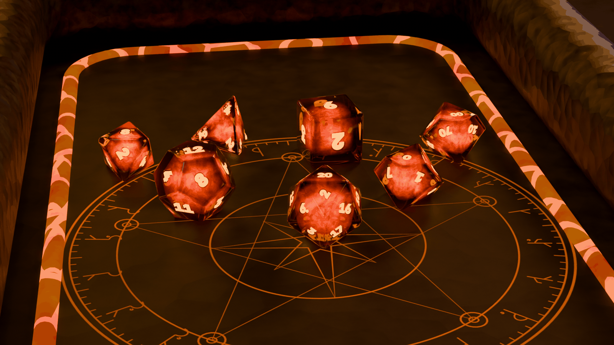

**Dice**:

- The shell is smoked amber glass: transmission 1, IOR 1.52, roughness
  0.02–0.14 from grime noise, a thin coat, and volume absorption with
  dark smoky amber at density 1.6.
- Inside is a smaller **core hull** (66% scale) with an emission-only
  volume. The flame comes from 4D noise over a domain-warped position,
  raised to the power 3 and faded radially: black → deep red → orange →
  pale gold.
- Sparse voronoi **ember flecks** burn at ~90.
- Numerals are engraved (height bump) and glow hot orange (emission 3.5).

**Environment: The Forge Hearth.**

- A cast-iron tray on a basalt forge slab. The floor is hammered, forged
  iron with an engraved five-point forge sigil whose grooves hold a faint,
  flickering ember glow.
- A **molten channel** rings the play area just inside the wall. It is
  crusted, with glowing cracks.
- The hammered iron rim has rivets.
- Two coal braziers with flames and rising sparks stand behind the wall,
  with a brick forge wall behind them. An anvil, ingots and tongs sit
  beside the tray, and embers drift in the air.
- Lighting: warm key, a cold blue rim for separation, the brazier point
  lights.

**Real time:**

- Shell: Android uses Filament transmission (solid refraction mode, thick
  absorption tint). iOS is alpha-blended smoky tint plus a fresnel-ish
  rim from clearcoat.
- Core: an inner mesh with an emissive flame texture, visible through the
  shell. Bloom does the rest.
- **Now:** "breathing" fire via emissive intensity and colour upserts at
  ≤ 10 Hz (a slow 0.6 Hz pulse plus a flicker). Numerals are an emissive
  mask.
- **Needs E6:** flowing noise inside the core (time-animated 3D noise) and
  refraction of the core that moves with the view.
- **Interim for E6:** two core shells (inner hot, outer cooler) with
  counter-rotating emissive textures, spun by the scene on a transform
  (cheap), which reads as moving fire.
- Environment: the molten channel and the sigil are emissive masks with
  an upserted intensity (surge on nat 20). Sparks and embers are W18
  particles (Android CPU sim; iOS one-shot emitters). Brazier flames are
  flipbook cards (E5b) or crossed emissive cards with an upsert flicker.
  The brazier is one real point light, unshadowed. Coals are baked
  emissive.
- **Juice**: impact flare (short point-light pop plus a spark burst at the
  contact), **ember burst on land**, sparks shed while tumbling (trail +
  particles), channel surge on crit.

### 3.2 Frostbound: "glacial ice with a cold heart"

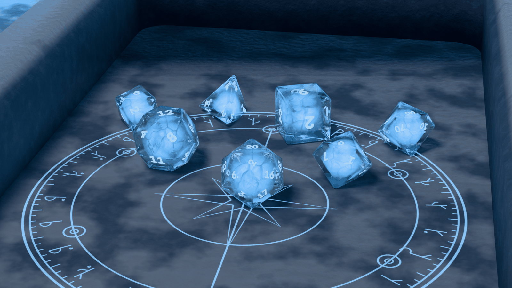

**Dice**:

- The shell is clear ice: transmission, IOR 1.31, roughness 0.015–0.46
  varied by frost-patch noise, micro-bump, and faint blue absorption.
- The core hull is a Principled volume with **fracture sheets**: thin
  voronoi distance-to-edge planes at two scales, plus cloudy inclusions,
  with a cold blue emission that is strongest at the heart.
- Numerals are **rime-frosted**: rough white with subsurface and a faint
  blue glow.
- G-channel frost dendrites creep in from each corner. Voronoi glints give
  a subtle sparkle.

**Environment: The Frozen Altar.**

- A frost-rimed granite altar with snow-capped walls (the snow is a
  material on up-facing normals).
- The floor has an engraved six-point ward circle whose grooves hold faint
  cold light.
- Hexagonal ice-crystal clusters stand on the altar ledge at the corners.
  Snow-capped boulders sit around it, and a glowing ice-cave wall stands
  far behind.
- Falling snow and cold ground mist around the altar base.
- Lighting: cool moon key, a blue cave glow, and a whisper of warm bounce
  so it isn't monochrome.

**Real time:**

- Shell: Android transmission; iOS alpha-blend with high clearcoat.
- **Fractures now**: the core mesh gets a few **internal crossed quads**
  with an alpha/emissive crack texture (baked from the voronoi sheets).
  It reads as internal fractures from every angle and costs about 20 tris.
- The cold heart is an emissive core with a slow upserted pulse.
- Sparkle: an emissive speckle mask plus W18 glitter particles on land.
- **Needs E6**: view-dependent glints and parallax depth in the ice.
- Environment:
  - Crystals are real geometry near the walls (few tris, transmission or
    alpha), with an unshadowed blue point light.
  - Boulders and the cave wall are baked.
  - Snow is W18 particles (low rate, large and soft near the camera).
  - Mist is 2–3 alpha gradient cards at the altar base (no volumes).
- **Juice**: **frost puff** on land (mist-card ring plus ice glitter),
  rime creeping across the ward circle on a crit (emissive mask upsert),
  a crystal chime.

### 3.3 Arcane Study: "gold-framed midnight"

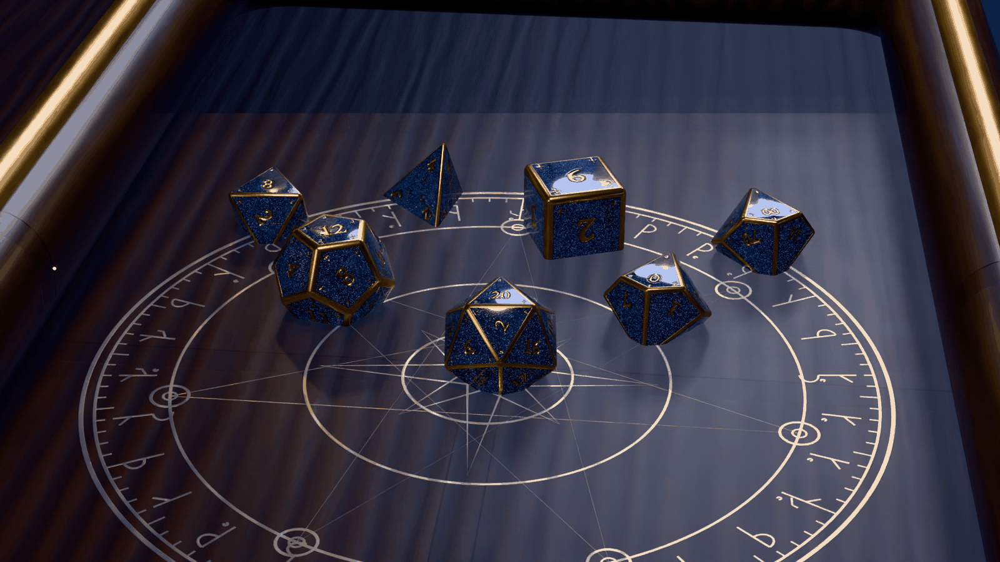

**Dice**:

- The body is deep midnight blue with a swirl, clearcoat and a little
  transmission.
- **Star-glitter inlay**: voronoi flakes with a random tint, metallic,
  with a per-flake bump so they wink.
- Raised **gold frames** come from the atlas alpha (bevel + lip). The
  numerals are gold, and so are small four-point star marks at the
  corners.
- The body is closest to operator reference 1.

**Environment: The Night Study.**

- A dark oak board **inlaid with an engraved brass sigil circle**. The
  circle is seven-pointed, with a rune band, 120 ticks and a compass rose;
  it is the hero object. A brass-capped oak rim with corner bosses frames
  the board.
- Around it:
  - three candles on brass dishes, with drips
  - stacked leather tomes with gilt bands (no titles)
  - a brass armillary
  - a bowl of glowing blue runestones
  - star-stitched velvet, coins, inked maps, an inkwell and quill, and
    an hourglass
- A moonlit window behind; dust motes in the air.
- Warm candlelight versus a cool magical blue.

**Real time:**

- Everything on the dice is standard PBR from the atlas: gold frame via
  metal mask, glitter via a high-frequency normal map plus a
  metal/roughness speckle map, clearcoat.
- **Now:** moving lights and the tumble make the flakes wink.
- **Needs E6:** true view-dependent glitter.
- Environment:
  - The board is one mesh: the brass inlay is a metallic mask plus a
    normal map from the sigil mask, plus a faint emissive mask for
    "ignite" effects.
  - Candles: wax meshes baked into the prop atlas, flames as small
    flipbook sprites (E5b) or emissive teardrop cards with flicker
    upserts, and one or two unshadowed warm point lights.
  - Tomes, armillary, coins and maps are baked low-poly.
  - Runestones are emissive, and dust motes are W18 particles.
- **Juice**: the rune band ignites around the ring toward the landing
  die; the runestones pulse with the total.

### 3.4 Fate Engine: "the machine is the environment"

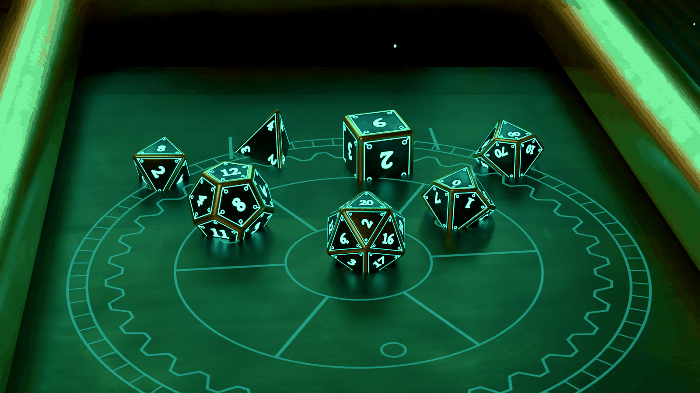

**Dice**:

- Machined gunmetal: brushed anisotropic streaks via bump; iOS drops
  anisotropy.
- Brass frames come from the atlas alpha.
- Numerals and **sigil marks** (inset ring, corner pads) are emissive
  teal.

**Environment: The Fate Engine.**

- A brass dice engine stands at the head of the tray:
  - a plinth, deck and crown
  - twin **glass charge tubes** filled with teal light
  - a gyroscopic cradle around a glowing core
  - gear trains, a pull lever and a blank nameplate
- The rolling area is its output tray: a dark steel plate engraved with a
  **gear-and-orbit pattern** whose grooves carry a faint teal charge,
  walled by a riveted brass rail.
- Workshop props: a teal-sand hourglass, tomes, a candle, calipers, maps
  and an armillary.

**Real time:**

- Dice and plate: emissive masks plus bloom.
- The engine is a baked prop mesh except for the tubes, which are
  emissive cylinders with **scrolling UVs**. The scroll needs E5c/E6;
  interim is an emissive intensity pulse via upsert, plus W18 bubbles.
- Gears rotate with plain node transforms: cheap, and they look alive.
- The core is an emissive sphere with an unshadowed teal point light.
- **Juice**:
  - Pulling the lever (or the throw gesture) drives the whole machine:
    gears spin up, the tubes surge, and the core flashes on a crit.
  - The dice drop from the chute, so the throw origin is fixed and
    diegetic.

### 3.5 Celestial Observatory: "a night sky caught in resin"

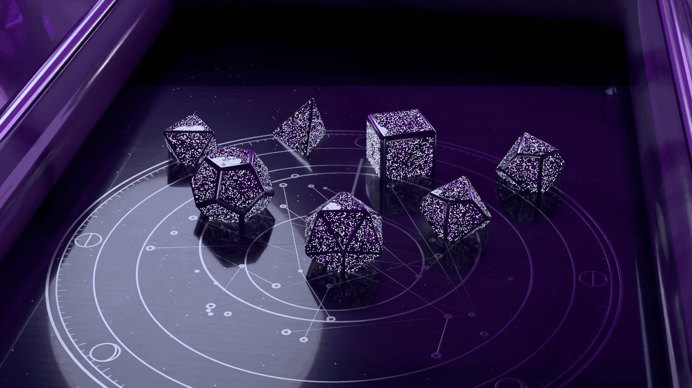

**Dice**:

- Violet nebula resin: domain-warped noise with a violet ramp, faint
  emission in the brightest wisps, and pin-point star flakes.
- Silver edges come from the atlas alpha. Star marks are in G.

**Environment: The Star Balcony.**

- A veined marble table on a night balcony.
- The rolling field is dark lapis with gold flecks, inlaid with a silver
  **astrolabe**: an eight-phase moon ring, a 180-tick scale, an invented
  star chart and a rete ring.
- Amethyst clusters, a silver armillary, a star globe and a brass lantern
  sit around it.
- A marble balustrade stands in front of a violet star-dusted sky.

**Real time:**

- Bake the nebula into the dice atlas (baseColor + emissive): the 3D
  noise is baked per face cell.
- The star speckle is an emissive map.
- The sky is a low-res equirect or a sky card (E3 for a generated one).
- **Juice**: star streaks (trails) while dice fly; the astrolabe rete
  rotates to point at the result.

### 3.6 Hearthside Tome: "old bone, firelit"

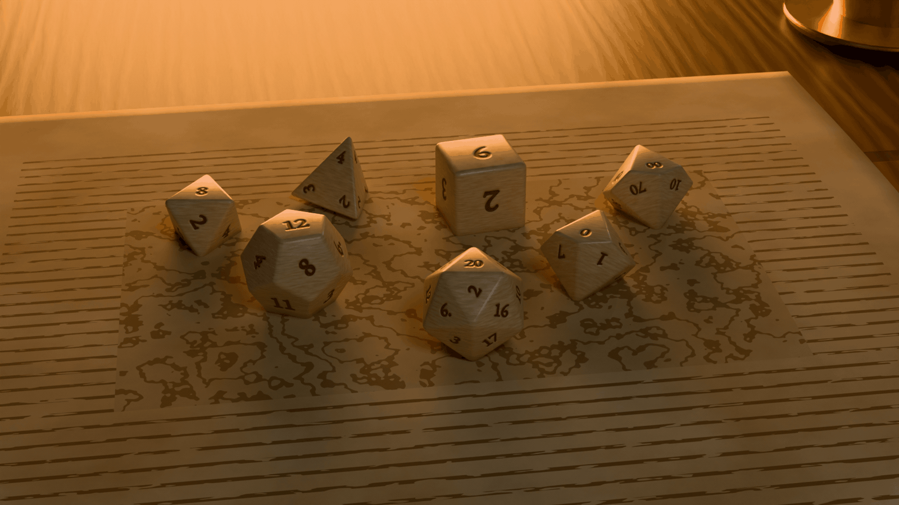

**Dice**:

- Bone and ivory: a grain along one axis, AO-darkened wear in the
  crevices, subsurface, a light coat.
- Sepia-inked engraved numerals.

**Environment: Fireside Reading.**

- The rolling surface is a **huge open tome**, spine across the screen
  (portrait-friendly). Its pages are bowed to the gutter, with ruled text
  blocks (abstract dashes, no words), an ink-wash plate and a ribbon
  marker.
- A hearth glows behind.
- Around the tome: a stoneware mug, a velvet dice pouch, wax seals,
  dried lavender and a candle.

**Real time:**

- The pages are one curved mesh with a single 2048² page texture.
- The tome's gutter dip must be reflected in the physics floor. Either
  use a flat collider (dice never reach the gutter), or accept a small
  lip.
- Fire glow is an emissive card plus a flickering warm light upsert.
- **Juice**: pages flutter (vertex animation or a card) on a crit.

### 3.7 Old Road: "wayfarer's gold"

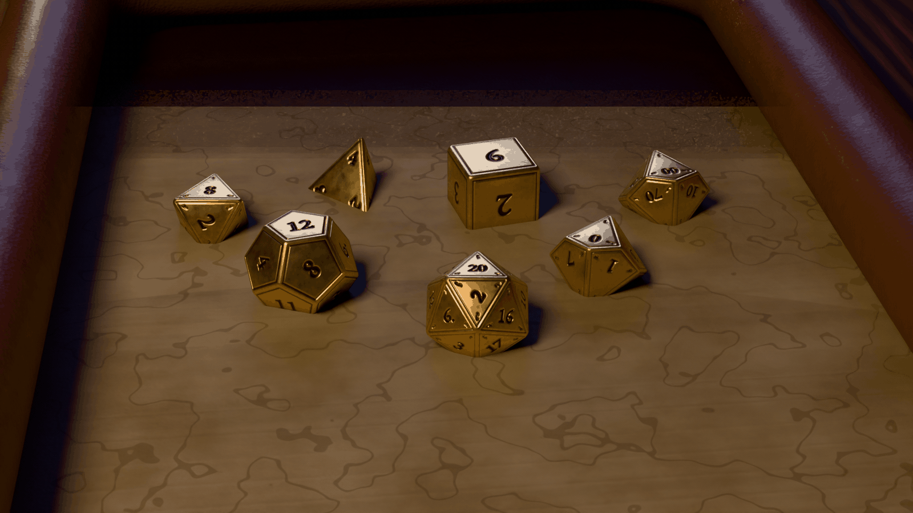

**Dice**:

- Worn gold with AO-darkened recesses, noise wear and stretched-noise
  scratches.
- Numerals (EB Garamond) and flowing original **runes** are cut and
  filled with black niello.

**Environment: The Wayfarer's Table.**

- A weathered inn table.
- The rolling surface is a hand-inked **map of an invented land**,
  stretched inside a stitched-leather rim.
- A tin lantern, a clay pipe, a satchel and strap with a buckle, coins,
  bread and a wooden mug.
- A blue-hour window versus warm lantern light.

**Real time:**

- Standard PBR. The niello fill is the baseColor from the atlas.
- The lantern is an emissive glass plus one warm point light.
- **Juice**: the lantern flame gutters on a hard landing; dust puffs off
  the map.

### 3.8 Northfield Relay: "1986 lab hardware" (loop-era, original)

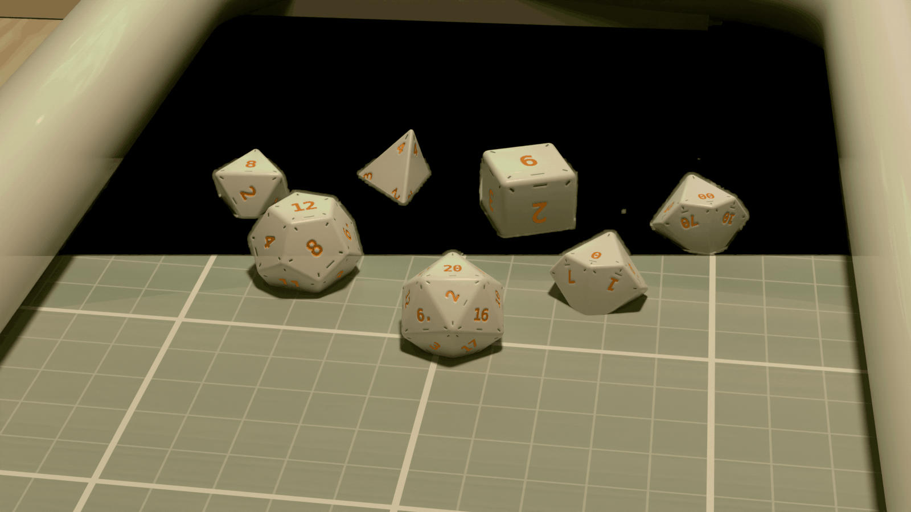

**Dice**:

- Warm-white ABS with slight subsurface and a fine texture.
- Numerals are orange instrument print (DejaVu Sans Mono), with teal
  calibration ticks and an index notch.

**Environment: Kitchen Table, 1986.**

- A pale birch kitchen table under a low orange pendant lamp.
- The tray is a beige instrument case lined with a sage rubber mat printed
  with a 1 cm / 5 cm calibration grid.
- A chunky CRT terminal glows green (scanlines, blocky text), next to an
  odd teal field instrument with dials, toggles and LEDs.
- A coffee cup, a coiled cable, a printout, and a grey-blue dusk window.

**Real time:**

- All standard. The CRT screen is an emissive texture with a scanline
  scroll: interim is an upsert, with E6 or E10 (external texture) for live
  "terminal text" showing the roll log.
- **Juice**: the CRT prints the roll result; the instrument needle swings
  with the total.

### 3.9 Voltline: "black mirror chrome, neon-lit"

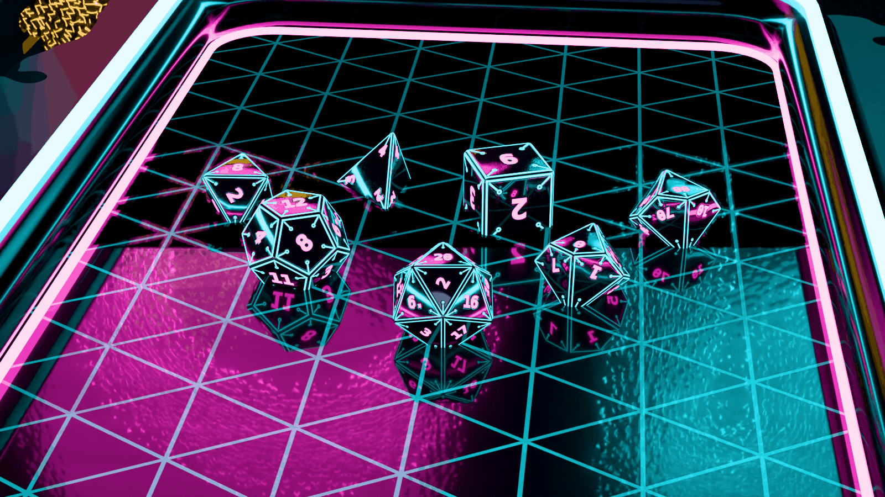

**Dice**:

- Black chrome with a heavy clearcoat.
- Magenta emissive numerals and cyan **circuit-trace rims** (bevel border
  plus corner traces and pads in G).

**Environment: Rain Counter.**

- A late-night diner counter, wet with puddles (a roughness mask plus a
  clearcoat mask).
- The rolling area is a **holo tray**: smoked black glass with a faint
  pulsing triangular grid of light, a cyan neon rim tube and a magenta
  inner line.
- Rain-streaked window glass, with abstract neon signage outside (shapes,
  no words) and rain particles.
- A chrome napkin box, a paper cup and a phone.

**Real time:**

- Emissive plus bloom is the whole look, and it is fully supported.
- Wet reflections: on Android, screen-space reflections if Filament's are
  exposed; otherwise a planar-reflection fake. On iOS, `SCNFloor`
  reflectivity (E8 note) or rely on the clearcoat plus IBL of the neon.
- **Juice**: grid ripples from the landing point (emissive mask upsert,
  or E6 for a real ripple); neon flicker on a crit.

### 3.10 Vermilion Court: "urushi and gold"

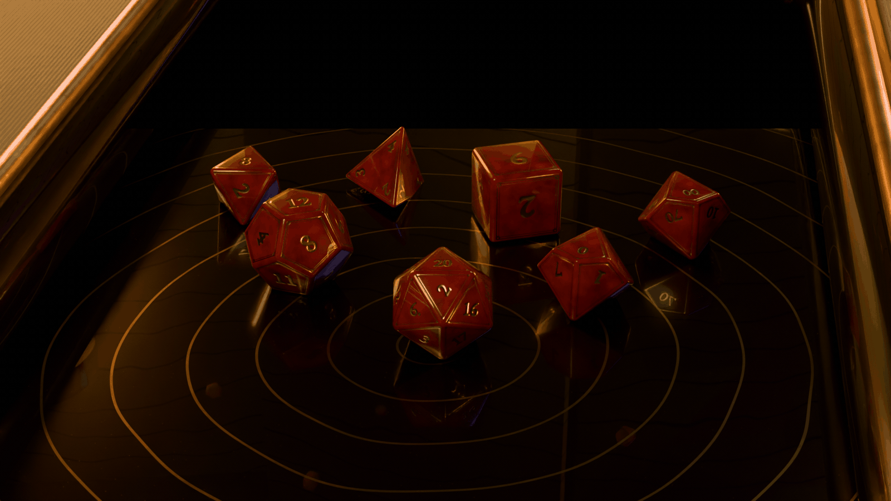

**Dice**:

- Deep urushi-red lacquer with depth variation, a glassy coat (IOR 1.55)
  and sparse gold flakes.
- Gold-leaf numerals (EB Garamond) and double gold inlay borders with
  corner dots.

**Environment: Lantern Pavilion.**

- A black-lacquer shrine tray with a gold-dust wave pattern and a gilt
  rim, set on tatami.
- Paper lanterns at the corners and a folding screen with gold-leaf
  panels and painted waves.
- A celadon tea cup, and drifting petals.
- Ties to the M18 diorama palette.

**Real time:**

- Standard PBR plus clearcoat.
- Lanterns are emissive paper plus unshadowed warm point lights.
- Petals are W18 particles; flat sprites are fine.
- **Juice**: a petal burst on land; a lantern sway on a hard hit.

### 3.11 Gemcutter: "classic swirled gems"

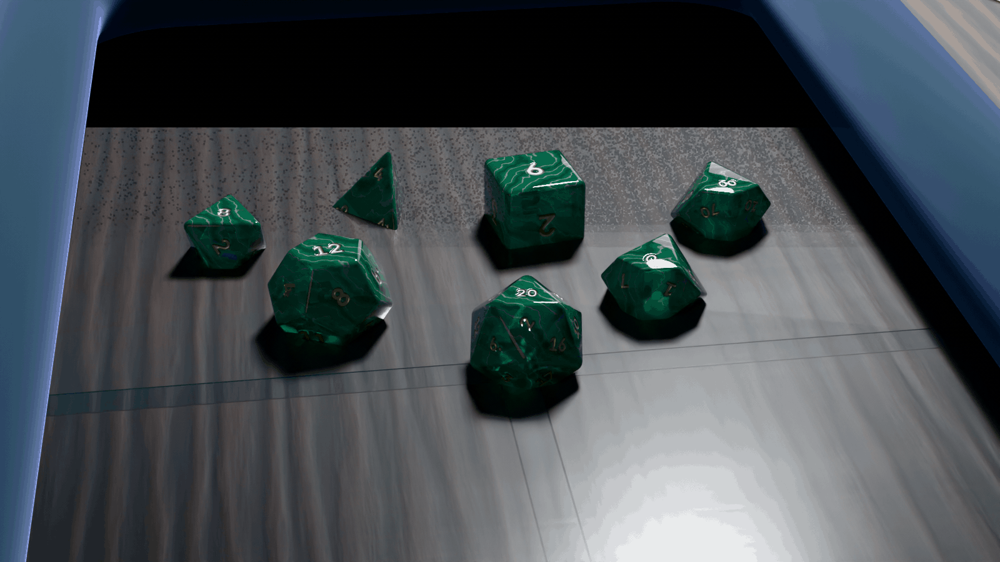

**Dice**:

- Emerald-and-pearl swirl: distorted band noise, partial transmission,
  coat and subsurface.
- Gold-painted numerals.
- This is the classic polyhedral "gemstone" look, and the easiest to
  vary: swap the ramp for sapphire, ruby, amethyst or opal.

**Environment: The Jeweler's Bench.**

- A deep-teal velvet tray with a padded rim on a walnut bench, lit by a
  cool daylight bench lamp.
- A brass loupe, tweezers, glass-lidded gem cases with loose cut stones
  (an original brilliant-ish cut), gem papers and a brass balance.

**Real time:**

- Bake the swirl into baseColor. Android uses partial transmission; iOS
  uses alpha.
- Loose gems are low-poly glass with a high-contrast IBL.
- **Juice**: a loupe zoom on the result (camera dolly to the d20).

---

## 4. dart3d features to verify (before building these for real)

1. **Emissive intensity > 1 + bloom threshold** on both platforms, and
   emissive *texture* support. Check that SceneKit `emission` takes a
   texture and an intensity.
2. **Material upsert rate**: 10 Hz emissive and colour animation on 7
   dice plus the environment without hitches on the A142 (W22 lane).
3. **Transmission on Android** (Filament refraction mode and thickness)
   and the **iOS alpha fallback**. Check the look of a dark shell over an
   emissive core on iOS.
4. **Nested meshes per die** (shell + core, parented) under one rigid
   body. Check that the physics collider is only the outer hull.
5. **Internal alpha cards** (the frost fractures): sorting inside a
   transmissive shell on both backends.
6. **Clearcoat** (both) and anisotropy (Android only). Check that
   iOS's loss of anisotropy is acceptable for Fate Engine and steel.
7. **KTX2 UASTC normal maps** on both, and a 4-texture material per die
   set.
8. **Unshadowed point lights**: per-light shadow toggle and the light
   count budget (3–4 small lights plus one shadowed key).
9. **Fog** or an equivalent for the "mist cards" fallback.
10. **Particles**: W18 one-shot bursts on iOS (bursts are ignored today,
    per §3.5). Ember burst, frost puff and petals need either a burst
    workaround (a short high-rate emitter) or an iOS fix.
11. **Flipbook sprites** (E5b) for candle and brazier flames. Interim:
    crossed emissive cards.
12. **Node transform animation** (gears, rete, lantern sway) at 60 Hz
    from Dart without per-frame payload churn.
13. **Transparent SceneView (X1)** is *not* needed. Every environment
    here is in-scene, which sidesteps X1 and D6.

---

## 5. Open points for the operator

- **Pick** which environments go to production first. Suggested:
  Emberforged → Frostbound → Arcane Study → Fate Engine, matching the
  batches.
- **d4 style**: true tetrahedron with vertex-read numerals (this look-dev)
  or the elongated crystal d4 of the existing sets. Physics readout
  differs (vertex vs face); both are supported by the face-map schema.
- **Die size vs screen**: the 15 × 31 cm play area gives upstream-like
  die size on phones. A tablet shows more of the environment around the
  walls (the props are modelled for that).
- The *final* dice for the app come from this script (`--export-glb`),
  then the fsceneb conversion. Baking of procedural textures (nebula,
  swirl, fire) into the atlas is the next tool step (a `--bake` mode), not
  done in this pass.
