# Dice look-dev: themed sets and their rolling environments (plan P3)

Status: look-dev **round 2.1** for operator review, 2026-09-30 (round 2 +
refined numerals and a stricter readability gate, §0.5). Nothing here
is app code. Source of truth for the renders:
`dart3d/example/tool/dice_lookdev/` (Blender 5.2.2, Cycles). Renders:
`docs/design/dice-lookdev/`. Context: `docs/design/demo-program.md` §3
(upstream's roller) and §5 (our Dice Roller plan).

Twelve sets. **DartNative** (§3.12: the 3D logo suspended in frosted
glass) is the dart3d example app's own dice set; the eleven themed sets move to a separate dice-roller app. Each is a
**dice set plus the environment it is rolled in**:
an engraved rolling surface as a hero object, framing props, a lighting
mood and atmosphere. The two signature sets are Emberforged (fire) and
Frostbound (ice).

**Judge from `all-sets-topdown.jpg` first.** The app's camera looks
straight down, so every set now has a top-down in-app view as its primary
render, and every set has to pass a measured readability gate on that view
(§0.2).

| # | Set | Environment | Top-down (primary) | Hero | d4 close-up | Room (§3b) |
|---|---|---|---|---|---|---|
| 0 | **DartNative** (example app) | Obsidian tray (recommended of 3) | [topdown](dice-lookdev/dartnative-a-topdown.jpg) · [real-time](dice-lookdev/dartnative-a-rt-topdown.jpg) | [hero](dice-lookdev/dartnative-a-hero.jpg) | [d20](dice-lookdev/dartnative-a-d20.jpg), [d4](dice-lookdev/dartnative-a-d4.jpg) | — |
| 1 | **Emberforged** | The Forge Hearth | [topdown](dice-lookdev/emberforged-topdown.jpg) | [hero](dice-lookdev/emberforged-hero.jpg) | [d4](dice-lookdev/emberforged-d4.jpg) | [room](dice-lookdev/emberforged-room.jpg) |
| 2 | **Frostbound** | The Frozen Altar | [topdown](dice-lookdev/frostbound-topdown.jpg) | [hero](dice-lookdev/frostbound-hero.jpg) | [d4](dice-lookdev/frostbound-d4.jpg) | [room](dice-lookdev/frostbound-room.jpg) |
| 3 | **Arcane Study** | The Night Study | [topdown](dice-lookdev/arcane-topdown.jpg) | [hero](dice-lookdev/arcane-hero.jpg) | [d4](dice-lookdev/arcane-d4.jpg) | [room](dice-lookdev/arcane-room.jpg) |
| 4 | **Fate Engine** | The Fate Engine | [topdown](dice-lookdev/fateengine-topdown.jpg) | [hero](dice-lookdev/fateengine-hero.jpg) | [d4](dice-lookdev/fateengine-d4.jpg) | [room](dice-lookdev/fateengine-room.jpg) |
| 5 | Celestial Observatory | The Star Balcony | [topdown](dice-lookdev/celestial-topdown.jpg) | [hero](dice-lookdev/celestial-hero.jpg) | [d4](dice-lookdev/celestial-d4.jpg) | [room](dice-lookdev/celestial-room.jpg) |
| 6 | Hearthside Tome | Fireside Reading | [topdown](dice-lookdev/hearthside-topdown.jpg) | [hero](dice-lookdev/hearthside-hero.jpg) | [d4](dice-lookdev/hearthside-d4.jpg) | [room](dice-lookdev/hearthside-room.jpg) |
| 7 | Old Road | The Wayfarer's Table | [topdown](dice-lookdev/oldroad-topdown.jpg) | [hero](dice-lookdev/oldroad-hero.jpg) | [d4](dice-lookdev/oldroad-d4.jpg) | [room](dice-lookdev/oldroad-room.jpg) |
| 8 | Northfield Relay | Kitchen Table, 1986 | [topdown](dice-lookdev/northfield-topdown.jpg) | [hero](dice-lookdev/northfield-hero.jpg) | [d4](dice-lookdev/northfield-d4.jpg) | [room](dice-lookdev/northfield-room.jpg) |
| 9 | Voltline | Rain Counter | [topdown](dice-lookdev/voltline-topdown.jpg) | [hero](dice-lookdev/voltline-hero.jpg) | [d4](dice-lookdev/voltline-d4.jpg) | [room](dice-lookdev/voltline-room.jpg) |
| 10 | Vermilion Court | Lantern Pavilion | [topdown](dice-lookdev/vermilion-topdown.jpg) | [hero](dice-lookdev/vermilion-hero.jpg) | [d4](dice-lookdev/vermilion-d4.jpg) | [room](dice-lookdev/vermilion-room.jpg) |
| 11 | Gemcutter | The Jeweler's Bench | [topdown](dice-lookdev/gemcutter-topdown.jpg) | [hero](dice-lookdev/gemcutter-hero.jpg) | [d4](dice-lookdev/gemcutter-d4.jpg) | [room](dice-lookdev/gemcutter-room.jpg) |

Sheets: `all-rooms.jpg` (the eleven game-room establishing shots, §3b),
`all-sets-topdown.jpg` (every set as the phone shows it),
`all-sets-hero.jpg` (heroes), `readability-crops.jpg` (the seven dice of
every set at phone pixels, 1:1). Per set: `<theme>-topdown.jpg`
(1179×2556, iPhone portrait, straight down with the app's fov),
`<theme>-hero.jpg` (1600×900, 3/4 view), `<theme>-d4.jpg` (1000×625), and
`<theme>-d20.jpg` (1000×625) for Emberforged, Old Road, Vermilion and
Gemcutter. DartNative has three environment options and a Blender-reference
vs real-time pair for every shot (§3.12). §3a has the in-app play-view rules (keep the surroundings
from competing with the dice) and an intro shot per set for the dice-roller
app.
All renders are full-colour JPEG q90 (round 1's 128-colour palette PNGs
are gone). `readability.json` holds every measurement.

**IP guardrail.** Every name, symbol and pattern here is original. The
TTRPG lines and the operator's AI mood boards were inspiration only: no
game titles, logos, trademarked symbols or fonts, no copied slogans (props
carry no text at all; the engine's nameplate is blank, the newspaper and
notebook are abstract strokes). Runes and sigils are generated from
strokes by our own code (`_rune`, `sigil_strokes`) and are not a real
script. Fonts: Inter (OFL, bundled with Blender), DejaVu Sans Mono
(Bitstream Vera licence, bundled with Blender) and EB Garamond (OFL,
vendored in `tool/dice_lookdev/fonts/` with its licence).

---

## 0. Round 2

### 0.1 What changed (operator feedback → change)

| Feedback | Change |
|---|---|
| "Dice numbers must be super readable no matter what." | A readability system (§0.2) with a measured gate on the top-down view; every set passes. Numerals are 20–40% bigger relative to their face (and the dice 1.3× bigger), and every set has a chosen numeral treatment. |
| Vermilion Court too dark to read | Brighter vermilion lacquer; gold-leaf numerals (part diffuse) in a black-lacquer keyline; side key placed so its mirror image misses the tray; a soft overhead for the gold; matte-ish tray lacquer (round 1 mirrored the lanterns as white discs). A z-fight between the tray floor and its base (half the floor went black) is fixed, in every environment that had it. |
| "You can't see the arcane ones" | The tray bed is now a brushed-brass field with the sigil engraved dark; oak shows as a border. A warm candle key pools on the tray from the candle cluster; the gilt numerals glow softly. Far-side numerals no longer show through the body (transmission 0.25 → 0.04). |
| "Camera is still face down" | The primary render is the app's camera: straight down, fov 0.95 rad (`dice_table_scene.dart`), 1179×2556, rims at the screen edges, every die settled with a result up. Dice are 1.3× larger (in-app size: `dice_table_scene` uses ~23–33 mm dice in a 132 mm tray). |
| No tetrahedron d4 | The d4 is a long crystal **shard** that rests on a long face; the result is the big numeral on the top face (§0.3). Face map updated. |
| "Kitchen table doesn't look like a kitchen table" | Northfield is now a 1980s kitchen table seen from above: wood-grain laminate, a stoneware mug on a cork coaster, a plate with a toast crust and crumbs, the morning paper, a spiral notebook with a pencil, a pocket radio and salt shaker, plus the CRT keyboard, field instrument and coiled cable; the calibration mat is dark green. |
| Dice clipping into the tray (coordinator) | Every die is dropped onto whatever is under it (ray-cast per low vertex) and a contact report checks gap and interpenetration per die per shot (§0.4). |
| Fate Engine too green | Bright brushed-steel plate with a brass-inlaid gear pattern, sigils on the dice in brass, teal only in the numerals and the machine's core/tubes (dimmed). |
| Emberforged molten channel pale | A deep-orange melt with dark crust rafts whose edges burn yellow. |
| Celestial dice grey-violet | Saturated indigo → violet → magenta nebula with cyan wisps and more glow. |
| Gemcutter banding | Domain-warped noise swirl (deep emerald, jade ribbons, thin pearl wisps) replaces the regular wave bands. |
| Posterized renders | Full-colour JPEG q90, pixel-for-pixel the measured render (only JPEG compression in between); ~10 MB for everything. |

Every set and every tray from round 1 is kept. Low props were added to the
strips above and below each tray so the environment reads at top-down (tall
props leave the frame under perspective, so the strips carry coins,
papers, a fan, loose gears, a phone, a compass...).

### 0.2 The readability system

**Rules (every set):**

1. **Numeral contrast** on the top face, as rendered (display sRGB after
   tone mapping, not albedo): WCAG relative luminance of the numeral's
   **stroke core** against the **plain face** right around it, **≥ 4.5 : 1**
   on every die, taken worst-quartile (the numeral's weakest quarter vs the
   face's closest quarter, so wear, AO, flakes and texture count). The
   keyline is *not* counted for non-glowing sets: their numerals must read
   on the face itself. Glowing sets may count their keyline/glow ring.
   (Round 2 measured medians against the ring including the keyline;
   round 2's Old Road passed that at 6.2 : 1 and was unreadable by eye.
   Re-measured with this rule it fails at 3.8 : 1, plus the stroke gate.)
2. **Numeral size**: the top-face numeral's height is **≥ 40% of the
   face's inscribed width** (worst face of each die, measured from the
   atlas). All dice are also 1.3× the round-1 size, so a d20 numeral is
   ~26 px tall on a 1179 px wide phone render and the d6's ~56 px.
   **Stroke weight**: mean stroke width / numeral height **0.10–0.14**
   (a medium weight with open counters; 2 × area / boundary length, from
   the atlas). Round 2's emboldened glyphs were 0.22–0.28.
3. **A numeral treatment chosen per theme** (table below): glowing
   (emissive numerals, usually inside a dark keyline), inked/filled, bright
   metal or enamel with a dark keyline. The keyline is a second texture in
   the atlas layout (`<theme>_halo.png`: R = numeral dilated by ~0.1 face
   inradius, G = soft glow), so it is exact per glyph. Round 2.1 halved it.
4. **Die vs tray**: the die's silhouette must separate from the tray around
   it by **≥ 2 : 1**, taking the best of three readings: the die's median
   body tone, its mean (which counts glowing numerals and metal edges),
   and its outline (the die's outer 2 px, for rim-lit or neon-edged dice;
   only Voltline needs it). This drove a lighter or darker field under
   most sets (Arcane brass field, Frostbound slate, Gemcutter light grey
   velvet, Fate Engine bright steel, Voltline lightbox, Hearthside
   tea-stained vellum, Old Road dark map, Northfield dark-green mat).
5. **Top-down lighting rules** (the round-1 failures were mostly these):
   - Never put a small, bright light near the camera axis: its reflection
     lands on the top faces as a hotspot over the numeral.
   - Place side keys so their mirror image in a glossy floor lands
     *off* the tray (for a camera at height h and a light at (x, z), the
     reflection sits at x·h/(z+h)).
   - Straight down, a metal numeral or frame mirrors the ceiling. Every
     metal-numeral set gets a big, soft overhead source (`E.overhead`);
     in real time that is the zenith of the IBL.
   - Glass dice print their numerals on the outside only (back-facing
     glyphs are masked), or the far face reads mirrored through the body.

**The check** (`tool/dice_lookdev/readability_check.py`) runs on every
top-down render (`render_set.py --check`, always on in `render.sh`):

- The beauty frame is kept as a lossless PNG. A second, exact **mask
  pass** re-renders the same camera with each die's material swapped for
  an emission-only mask (R = numeral from the atlas, G = "top face": true
  normal within 14° of up, B = die id), everything else hidden, 1 sample,
  no pixel filter, EXR.
- The mask pass also marks the keyline ring (G = 0.5), so the check knows
  numeral, keyline and plain face per pixel.
- Per die: stroke core = the numeral eroded by ~¼ of its stroke width;
  face ring = plain face in a ring 1…1+r px outside numeral + keyline
  (r = 8% of the numeral's pixel height); "adjacent" ring = right outside
  the numeral, keyline included (counted only for glowing sets).
  Worst-quartile contrast as in rule 1. Die vs a 3–12 px ring of tray
  (other dice excluded, contact shadow included).
- Results merge into `readability.json`; `readability_check.py --table`
  prints the table below. `readability-crops.jpg` shows exactly the
  pixels that were measured.

Quick loop while iterating a set (≈1 min):

```
Blender --background --python dart3d/example/tool/dice_lookdev/readability_check.py -- \
    --theme arcane --samples 16 --pct 50 --out /tmp/rd
```

**Results** (full renders, 96 samples, 1179×2556):

| Set | Numeral treatment | Numeral stroke vs face, worst die (gate 4.5) | Keyline counted? | Die vs tray, worst (gate 2.0) | Top numeral height | Numeral / face width (gate 0.40) | Stroke / height (gate 0.10–0.14) | Result |
|---|---|---|---|---|---|---|---|---|
| DartNative (a) | enamel: near-black numerals on frosted glass, denser-frost band (not counted) | 6.9:1 (d4) | no | 7.3:1 | 28 px | 0.41 | 0.12–0.13 | PASS |
| DartNative (a-rt) | enamel: near-black numerals on frosted glass, denser-frost band (not counted) | 7.8:1 (d10u) | no | 11.2:1 | 28 px | 0.41 | 0.12–0.13 | PASS |
| DartNative (b) | enamel: near-black numerals on frosted glass, denser-frost band (not counted) | 5.9:1 (d4) | no | 2.9:1 | 28 px | 0.41 | 0.12–0.13 | PASS |
| DartNative (c) | enamel: near-black numerals on frosted glass, denser-frost band (not counted) | 8.2:1 (d4) | no | 8.3:1 | 28 px | 0.41 | 0.12–0.13 | PASS |
| Emberforged | glowing: white-hot emissive numerals in a soot keyline | 5.1:1 (d12) | yes (glowing) | 2.4:1 | 26 px | 0.41 | 0.12–0.13 | PASS |
| Frostbound | glowing: emissive rime numerals on a deep-blue keyline | 5.8:1 (d4) | yes (glowing) | 2.1:1 | 25 px | 0.41 | 0.12–0.13 | PASS |
| Arcane Study | glowing: warm spell-lit gilt numerals, thin midnight keyline | 6.2:1 (d4) | yes (glowing) | 2.2:1 | 27 px | 0.43 | 0.12–0.13 | PASS |
| Fate Engine | glowing: aqua-charged numerals in a dark keyline | 13.8:1 (d10t) | yes (glowing) | 2.1:1 | 27 px | 0.43 | 0.12–0.13 | PASS |
| Celestial Observatory | glowing: starlight-silver numerals in an indigo keyline | 11.9:1 (d12) | yes (glowing) | 2.4:1 | 26 px | 0.41 | 0.12–0.13 | PASS |
| Hearthside Tome | inked: engraved, filled with sepia-black ink | 4.8:1 (d4) | no | 2.1:1 | 24 px | 0.43 | 0.12–0.13 | PASS |
| Old Road | enamel fill: oxblood-black enamel in bright polished gold | 4.8:1 (d4) | no | 3.0:1 | 27 px | 0.45 | 0.12–0.13 | PASS |
| Northfield Relay | inked: near-black instrument print on warm-white ABS | 7.3:1 (d10u) | no | 4.9:1 | 22 px | 0.42 | 0.12–0.13 | PASS |
| Voltline | glowing: magenta neon numerals in a black keyline | 14.3:1 (d10u) | yes (glowing) | 4.6:1 | 28 px | 0.42 | 0.12–0.13 | PASS |
| Vermilion Court | bright metal: pale gold leaf on deep urushi red, gilt edges (thin keyline) | 5.0:1 (d10u) | no | 2.1:1 | 29 px | 0.45 | 0.12–0.13 | PASS |
| Gemcutter | bright enamel: ivory-gold enamel on emerald (thin keyline) | 5.1:1 (d20) | no | 2.7:1 | 24 px | 0.41 | 0.12–0.13 | PASS |

"Keyline counted?" is yes only for the glowing sets; every other set
reads on the plain face.

### 0.3 The d4 shard

- A square prism along the die's long axis with pyramid caps: section
  1.3 cm, 3.2 cm tip to tip (`SHARD_HALF`, `SHARD_CAP` in `build_dice.py`),
  316 triangles. It rests on one of its four long faces, so the result is
  the face pointing up, read like every other die.
- Numbering: opposite long faces sum to 5 (4 up ↔ 1 down, 2 ↔ 3), asserted
  at build time. One numeral per long face, reading along the crystal,
  ~0.5 of the face width tall (the biggest numeral in the set). The eight
  cap facets are blank (their own atlas cells; 78 of 81 cells used).
- **Face map** (`dice_faces.lookdev.json`): the d4 lists only its four long
  faces with `"shape": "shard"` and no `readout` override: the existing
  "most aligned with up" readout works. The shard cannot come to rest on a
  cap facet: the centre of mass projects outside every cap triangle (a cap
  plane sits 0.78 × section from the centre, a long face 0.5), so it
  topples onto a long face and ignoring the caps is safe.
- Physics: use the convex hull (10 points) as the collider. It rolls along
  its long axis much more readily than end over end, so a throw needs a
  little extra spin about the long axis to look lively (DR2 tuning).

### 0.4 Placement and contacts

`env_common.place_layout()` orients each die (value up, numeral facing the
viewer) and `settle()` drops it straight down: for every vertex in the
die's lower third it ray-casts the surface below and lifts the die until
none is below it, plus a 0.004 cm gap. This handles bowed pages, rim lips
and trays at any height. `contact_report()` then records, per die and per
shot, the gap at the contact point and any interpenetration (BVH overlap)
with other dice or with environment meshes near the die; render_set prints
`CONTACT PROBLEMS` if any die has a gap outside 0…0.01 cm or overlaps
anything. The final renders have none (all gaps 0.004 cm, no overlaps).
There are no mid-roll shots in round 2.

### 0.5 Round 2.1: refined numerals, a stricter gate

Operator feedback on the round-2 contact sheet → change:

| Feedback | Change |
|---|---|
| "The numbers are too thick (like the number three)", Vermilion especially | The fonts are no longer emboldened (round 2 thickened every glyph outline by 3.5–4.5% of the em): stroke/height went from 0.22–0.28 to 0.12–0.13 (Inter and DejaVu at their regular weight, EB Garamond +0.6%), with open counters on 3/6/8/9. The em went up 13% so the numeral **height** is unchanged. Keylines are half as wide (~0.1 face inradius). |
| Old Road still unreadable (bottom-left) | Bright, clean polished gold (wear and AO only in the recesses), numerals filled with deep oxblood-black enamel with a crisp edge, the runes reduced to a shallow engraving (no enamel) so they never compete, the rune border moved out; the map is darker and quieter (low-contrast mottling, faint pale lines). |
| Tighten the gate | Stroke core vs plain face, worst quartile, keyline only for glowing sets, stroke-weight gate 0.10–0.14 (rules 1–2 above). Round 2's Old Road (re-rendered from commit 446d716, measured with the new check) fails: 3.8 : 1 on the d10t and stroke 0.24–0.28. |
| — (consequences of the stricter gate) | Vermilion: deep urushi red, pale gold-leaf numerals and gilt edges (maki-e), less coat sheen; the red is darker so the gold reads on the face itself. Gemcutter: brighter ivory-gold enamel, pale-jade wisps instead of pearl-white. Hearthside: denser ink. |

d20 close-ups of the refined numerals: [Emberforged](dice-lookdev/emberforged-d20.jpg),
[Old Road](dice-lookdev/oldroad-d20.jpg), [Vermilion](dice-lookdev/vermilion-d20.jpg),
[Gemcutter](dice-lookdev/gemcutter-d20.jpg).

---

## 1. How it is built

```
dart3d/example/tool/dice_lookdev/
  build_dice.py        geometry, numbering, glyph atlas, all dice materials, face map, glb export
  env_common.py        scene/render helpers, tray + rim builder, scatter, camera, settle + contact
                       report, overhead light, JPEG writer
  env_props.py         procedural props (candles, tomes, armillary, hourglass, gears, ...) + mask renderer
  build_env_<theme>.py one environment per theme (11)
  render_set.py        builds dice + environment, renders topdown / hero / d4 (+ --check)
  readability_check.py the readability gate (mask pass + measurements, --table)
  contact_sheet.py     all-sets-topdown.jpg, all-sets-hero.jpg, readability-crops.jpg
  render.sh            everything (./render.sh [themes...]; PCT/SAMPLES/SHOTS env for previews)
  fonts/               EB Garamond + OFL
  dice_faces.lookdev.json  face map for this geometry
```

Everything is procedural (no downloaded assets), so a render is a pure
function of the scripts and Blender 5.2.

Render settings: Cycles on Metal, 96 samples (`SAMPLES=96`; each
environment's default is 128–160) with OpenImageDenoise, **Khronos PBR
Neutral** view transform. AgX bleached the fire to white; PBR Neutral keeps
emissive hues and is also a tone mapper the real-time path can match.
Output: full-colour JPEG q90 (`env_common.save_jpeg`); the lossless PNG is
kept only in the temp dir for the readability check. About 1.5 h for all
eleven sets on an M4. Do not run two renders at once: Cycles runs out of
GPU memory.

Scale: 1 Blender unit = 1 cm. Dice are a standard set × `SIZE_SCALE` 1.3
(d20 ≈ 2.9 cm across), the in-app size; the tray's play area stays
15 × 31 cm.

### 1.1 Dice geometry and numbering (shared by every set)

| Die | Shape | Size | Bevel | Tris | Numbering (asserted at build time) |
|---|---|---|---|---|---|
| d4 | **shard**: square prism + pyramid caps, rests on a long face, read from the top face (§0.3) | 1.3 cm section, 3.2 cm long | 0.09, 3 segs | 316 | 1–4, opposite long faces sum to 5 |
| d6 | cube | 2.1 cm | 0.17, 4 segs | 300 | opposite faces sum to 7; 1-2-3 counter-clockwise |
| d8 | octahedron | 2.7 cm tip-to-tip | 0.09, 3 segs | 188 | sum 9 |
| d10 units | pentagonal trapezohedron (planar kites, exact) | 2.9 cm tall | 0.08, 3 segs | 316 | 0–9, sum 9, odd numbers around one pole |
| d10 tens (d%) | same | same | same | 316 | 00–90, sum 90 |
| d12 | dodecahedron | 2.9 cm | 0.09, 3 segs | 476 | sum 13 |
| d20 | icosahedron | 2.9 cm | 0.07, 3 segs | 476 | sum 21 |

- 6 and 9 carry a dot ("6." / "9.") on the d10, d12 and d20.
- All dice are modelled resting on a face (face up = +Z), so they sit flat
  in the tray.
- Every die is **< 500 triangles**, well under the 2–4k budget. That leaves
  room for more bevel segments on a "high" quality tier. The inner "core"
  hulls of the two glowing sets are 4–36 triangles.
- **Face map.** `dice_faces.lookdev.json` has the same schema as
  `assets/dice/dice_faces.json`: glTF Y-up normals, `"resultSide": "up"`.
  The d4 lists its four long faces (`"shape": "shard"`), like the existing
  Retro Classic and overlay crystal d4s; the "most aligned with up"
  readout works unchanged for every die.

### 1.2 One RGBA atlas per set

Every face is planar-projected into one cell of a 9×9 atlas (78 of 81 cells
used), so **all seven dice of a set share one texture**. The bevel strips
project into a band just inside each face outline. The atlas is rendered
with Workbench from real text and stroke curves:

| Channel | Content | Real-time use |
|---|---|---|
| R | numerals | numeral colour / emissive mask |
| G | theme decor (runes, frost dendrites, circuit pads, calibration ticks, stars, sigil rings, lacquer borders) | decor colour / emissive mask |
| B | engrave height (R∪G, blurred) | bake into a tangent-space **normal map** |
| A | **metal-edge frame**: bevel strip + a lip onto the face | metallic/roughness mask for the gold/brass/silver-framed sets |
| halo R | **keyline**: the numeral dilated by ~0.2 face inradius (round 2) | bake into baseColor (dark ring) and zero the emissive there |
| halo G | soft outer glow (numeral blurred) | optional emissive halo; unused in the stills (it lowers contrast) |

Look-dev renders use 4096²; 2048² is enough in real time. glTF wants
separate slots, so the shipping form per set is **baseColor(+alpha) +
metallicRoughness + normal + emissive**, all 2048² in the same UV layout.
Numeral placement is per die type and the font changes only per theme, so
sets that share a font can also share the normal map. Compress as KTX2:
UASTC for the normal map, ETC1S for colour (dart3d already loads KTX2).

Export: `build_dice.py --theme X --export-glb dir` writes one .glb per die
(geometry, UVs, and a placeholder material that embeds the 4096² look-dev
atlas, ~7 MB each; for production, share one 2048² KTX2 set across the
seven dice). The .fsceneb conversion follows the `dn_logo/build.sh`
recipe.

---

## 2. What makes upstream's roller feel premium, and how we beat it

From demo-program §3. Upstream's "Dice Shadows" feels expensive because of:

1. **Physics tuned for drama**: gravity −30 (3 g) with lively restitution
   (0.35/0.45), spin tied to the throw direction, and dice that fly in
   along *your* aim arrow.
2. **Every event fires on several channels at once**: outline, particles,
   light flash, camera shake, sound. Impacts are classified
   (clack/wall/surface) with a log volume curve and pitch scaled by force
   and material.
3. **Suspense on a clock**: accelerating count-up ticks
   (`0.26·0.92ⁱ`), a held multiplier reveal, a wind-up slam into the
   TOTAL sticker, and 0.18× slow-mo while a match is forming.
4. **Escalation**: bigger outcomes pay out bigger (fireworks, golden hour,
   hop, shattering cards).
5. **A physical world**: dice shadows on the UI, cards that press and
   crack, skid marks, trails only while flying.
6. **Material variety**: ten finishes (glass, opal, neon, steel, ...)
   over one lighting preset (sun el 46.8°, bloom, tilt-shift DOF).

What it lacks, and where these sets go further:

- **Only d6s on a flat UI.** We have a full polyhedral set (d4–d20 + d%)
  with engraved, readable numerals, in **eleven designed places** rather
  than one screen. Each place has an engraved hero surface, props that frame
  the phone's edges, and a light mood.
- **Finishes are surface-only.** Ours have **interiors**: a live coal
  inside smoked amber, fractured glacial ice with a cold heart, star glitter
  under gold frames, nebula resin. That depth is the "wow" in a close-up.
- **The surface reacts.** The engraved rolling surfaces (forge sigil, ward
  circle, brass sigil, engine plate, astrolabe) are emissive masks, so the
  scene can answer a result: the sigil ring under the landing die lights
  up, the molten channel surges, the engine's tubes flare.
- **Themed juice** on top of upstream's channel stack (flash + shake +
  particles + sound):
  - Emberforged: impact flares and an **ember burst on land**; sparks
    shed while tumbling; a nat 20 makes the molten channel surge round
    the tray.
  - Frostbound: a **frost puff** (a cold-mist ring plus ice glitter) on
    land; rime creeps across the altar ward on a crit.
  - Arcane Study: sigil runes ignite along the ring toward the result;
    the runestones in the bowl pulse.
  - Fate Engine: the charge tubes surge and the core flashes; the gears
    turn as the dice count up.
  - The others follow the same pattern: star streaks, falling petals,
    neon flicker, candle gutter, lamp flicker.
- **Escalation keyed to TTRPG moments**: nat 20 / nat 1 / doubles and
  d% "00" instead of upstream's match multiplier (demo-program §5.5 DR4).

---

## 3. The sets

Real-time notes use the capability table in demo-program §3.5. In short:

- **Now on both platforms**: base PBR, emissive + bloom, clearcoat
  (iOS OK), normal maps, material upserts (animate at ≤ 10 Hz), W18
  particles (iOS ignores bursts and turbulence), trails, one shadowed
  directional light with cascades on Android, extra unshadowed point
  lights, DOF.
- **Transmission/refraction**: Android approximated; iOS is alpha-blend
  (IOR, volume and dispersion dropped).
- **Waiting on units**: animated noise/flow shaders, true refraction,
  view-dependent glitter and parallax interiors wait for **E6** (shader
  contract). Instanced props and particles wait for **E1**. Sky/IBL
  generation waits for **E3**. Sprites and flipbooks wait for **E5b**.
  Animating material properties without an upsert per frame waits for
  **E5c**. Spot shadows wait for **E5**.

**Environment budget (all sets, mobile):**

- The tray is one mesh, ≤ 2k tris: floor plus rim. The engraved floor is
  one 2048² set (normal, roughness and emissive mask); the Workbench masks
  in the scripts are exactly those maps.
- Props are merged into **one baked prop mesh per environment**: ≤ 25k
  tris, one 2048² atlas with baked lighting/AO, and emissive where glowing.
- Hero props sit near the wall and stay real geometry, so they cast real
  shadows onto the tray: candles, a brazier, crystal clusters, the engine
  front.
- Far props become **baked low-poly silhouettes or cards**: walls,
  windows, the balustrade, the cave ice, the sky.
- Lights: one shadowed key plus ≤ 3 unshadowed point lights (candles,
  brazier, tubes). Everything else is baked.
- Atmosphere is particles and cards. Volumetric haze is not available in
  real time (and was too slow even for these stills), so fake it with
  camera-facing gradient cards and fog, if dart3d exposes fog (verify).

**Readability (all sets):** see §0.2. The play area is lower in detail
than the dice and separated from them in luminance (lighter *or* darker,
per set). The **long walls sit on the screen edges** in the top-down view
(frame width = tray + rims + ~1 cm), so a d20 is ~14% of the screen width.
Low props frame the top and bottom edges.

### 3.1 Emberforged: "a banked fire you can hold"

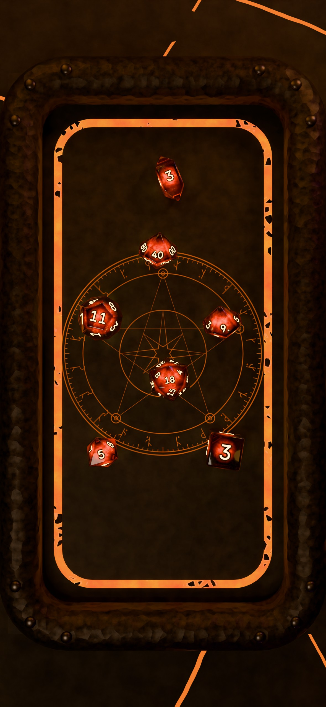

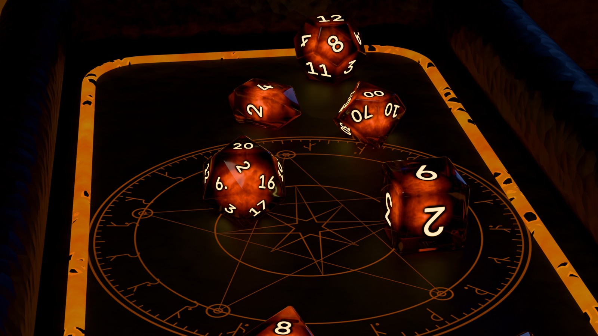

**Round 2.** Treatment: *glowing* — white-hot numerals (emissive 9, pale
gold) inside a soot keyline, so the fire behind the glass never touches
the digit. Less smoke in the glass (absorption 1.6 → 1.1) and a slightly
bigger core, so the dice glow amber rather than smoulder. The molten
channel is a deep-orange melt with dark crust rafts whose edges burn
yellow (round 1 read pale salmon). The forge floor stays dark: the dice's
own glow separates them.

**Dice**:

- The shell is smoked amber glass: transmission 1, IOR 1.52, roughness
  0.02–0.14 from grime noise, a thin coat, and volume absorption with
  dark smoky amber at density 1.6.
- Inside is a smaller **core hull** (66% scale) with an emission-only
  volume. The flame comes from 4D noise over a domain-warped position,
  raised to the power 3 and faded radially: black → deep red → orange →
  pale gold.
- Sparse voronoi **ember flecks** burn at ~90.
- Numerals are engraved (height bump) and glow hot orange (emission 3.5).

**Environment: The Forge Hearth.**

- A cast-iron tray on a basalt forge slab. The floor is hammered, forged
  iron with an engraved five-point forge sigil whose grooves hold a faint,
  flickering ember glow.
- A **molten channel** rings the play area just inside the wall. It is
  crusted, with glowing cracks.
- The hammered iron rim has rivets.
- Two coal braziers with flames and rising sparks stand behind the wall,
  with a brick forge wall behind them. An anvil, ingots and tongs sit
  beside the tray, and embers drift in the air.
- Lighting: warm key, a cold blue rim for separation, the brazier point
  lights.

**Real time:**

- Shell: Android uses Filament transmission (solid refraction mode, thick
  absorption tint). iOS is alpha-blended smoky tint plus a fresnel-ish
  rim from clearcoat.
- Core: an inner mesh with an emissive flame texture, visible through the
  shell. Bloom does the rest.
- **Now:** "breathing" fire via emissive intensity and colour upserts at
  ≤ 10 Hz (a slow 0.6 Hz pulse plus a flicker). Numerals are an emissive
  mask.
- **Needs E6:** flowing noise inside the core (time-animated 3D noise) and
  refraction of the core that moves with the view.
- **Interim for E6:** two core shells (inner hot, outer cooler) with
  counter-rotating emissive textures, spun by the scene on a transform
  (cheap), which reads as moving fire.
- Environment: the molten channel and the sigil are emissive masks with
  an upserted intensity (surge on nat 20). Sparks and embers are W18
  particles (Android CPU sim; iOS one-shot emitters). Brazier flames are
  flipbook cards (E5b) or crossed emissive cards with an upsert flicker.
  The brazier is one real point light, unshadowed. Coals are baked
  emissive.
- **Juice**: impact flare (short point-light pop plus a spark burst at the
  contact), **ember burst on land**, sparks shed while tumbling (trail +
  particles), channel surge on crit.

### 3.2 Frostbound: "glacial ice with a cold heart"

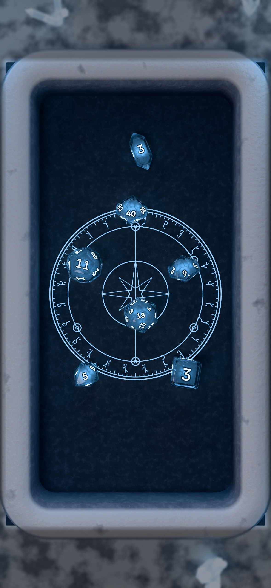

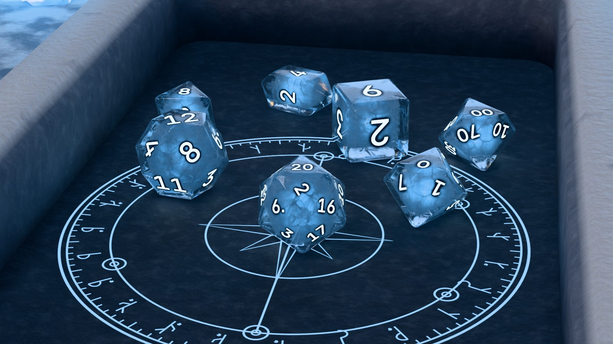

**Round 2.** Treatment: *glowing* — rime numerals with a cold emissive
(5) on a deep-blue keyline, like ink frozen under the frost. The altar's
play field is now blue-black slate (round 1's pale frosted granite was the
same luminance as the ice). No snow falls between the camera and the tray;
low ice shards sit in the strips.

**Dice**:

- The shell is clear ice: transmission, IOR 1.31, roughness 0.015–0.46
  varied by frost-patch noise, micro-bump, and faint blue absorption.
- The core hull is a Principled volume with **fracture sheets**: thin
  voronoi distance-to-edge planes at two scales, plus cloudy inclusions,
  with a cold blue emission that is strongest at the heart.
- Numerals are **rime-frosted**: rough white with subsurface and a faint
  blue glow.
- G-channel frost dendrites creep in from each corner. Voronoi glints give
  a subtle sparkle.

**Environment: The Frozen Altar.**

- A frost-rimed granite altar with snow-capped walls (the snow is a
  material on up-facing normals).
- The floor has an engraved six-point ward circle whose grooves hold faint
  cold light.
- Hexagonal ice-crystal clusters stand on the altar ledge at the corners.
  Snow-capped boulders sit around it, and a glowing ice-cave wall stands
  far behind.
- Falling snow and cold ground mist around the altar base.
- Lighting: cool moon key, a blue cave glow, and a whisper of warm bounce
  so it isn't monochrome.

**Real time:**

- Shell: Android transmission; iOS alpha-blend with high clearcoat.
- **Fractures now**: the core mesh gets a few **internal crossed quads**
  with an alpha/emissive crack texture (baked from the voronoi sheets).
  It reads as internal fractures from every angle and costs about 20 tris.
- The cold heart is an emissive core with a slow upserted pulse.
- Sparkle: an emissive speckle mask plus W18 glitter particles on land.
- **Needs E6**: view-dependent glints and parallax depth in the ice.
- Environment:
  - Crystals are real geometry near the walls (few tris, transmission or
    alpha), with an unshadowed blue point light.
  - Boulders and the cave wall are baked.
  - Snow is W18 particles (low rate, large and soft near the camera).
  - Mist is 2–3 alpha gradient cards at the altar base (no volumes).
- **Juice**: **frost puff** on land (mist-card ring plus ice glitter),
  rime creeping across the ward circle on a crit (emissive mask upsert),
  a crystal chime.

### 3.3 Arcane Study: "gold-framed midnight"

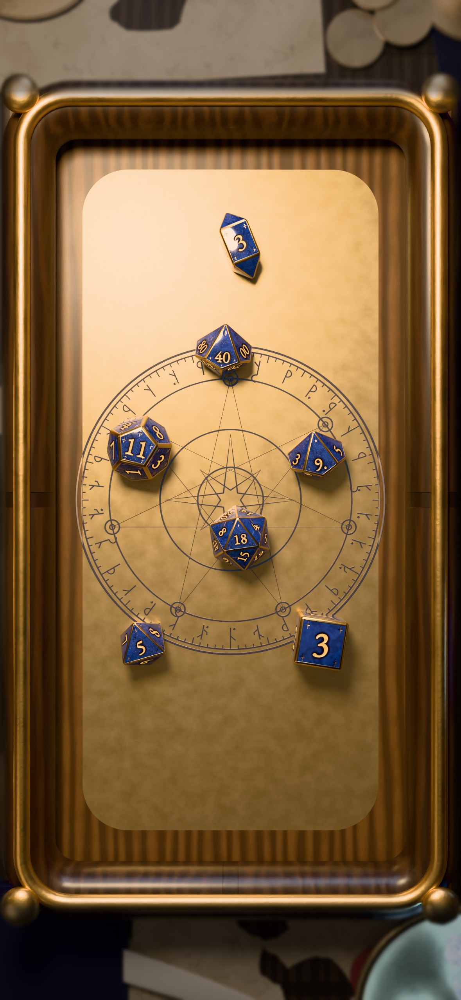

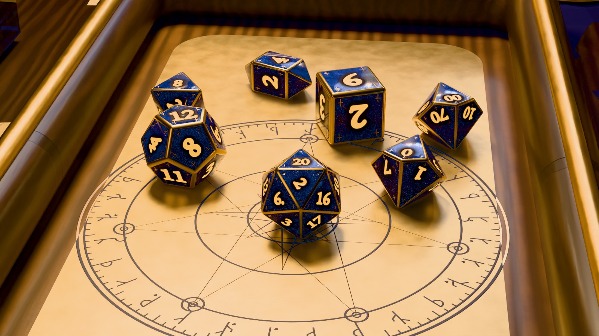

**Round 2.** Treatment: *glowing* — gilt numerals with a soft warm
emissive (spell-lit), a midnight keyline, gold frames. The dice body is a
little lighter blue and no longer shows its far-side numerals through the
body. The tray bed is a brushed-brass field with the sigil engraved dark
(the operator's "lighter brass circle field"), bordered by oak; a warm
candle key pools on it from the candle cluster; a big soft overhead gives
the gilt something to mirror. Strips: a map, coins, a sealed letter, a
quill, velvet, a bowl of glowing runestones.

**Dice**:

- The body is deep midnight blue with a swirl, clearcoat and a little
  transmission.
- **Star-glitter inlay**: voronoi flakes with a random tint, metallic,
  with a per-flake bump so they wink.
- Raised **gold frames** come from the atlas alpha (bevel + lip). The
  numerals are gold, and so are small four-point star marks at the
  corners.
- The body is closest to operator reference 1.

**Environment: The Night Study.**

- A dark oak board **inlaid with an engraved brass sigil circle**. The
  circle is seven-pointed, with a rune band, 120 ticks and a compass rose;
  it is the hero object. A brass-capped oak rim with corner bosses frames
  the board.
- Around it:
  - three candles on brass dishes, with drips
  - stacked leather tomes with gilt bands (no titles)
  - a brass armillary
  - a bowl of glowing blue runestones
  - star-stitched velvet, coins, inked maps, an inkwell and quill, and
    an hourglass
- A moonlit window behind; dust motes in the air.
- Warm candlelight versus a cool magical blue.

**Real time:**

- Everything on the dice is standard PBR from the atlas: gold frame via
  metal mask, glitter via a high-frequency normal map plus a
  metal/roughness speckle map, clearcoat.
- **Now:** moving lights and the tumble make the flakes wink.
- **Needs E6:** true view-dependent glitter.
- Environment:
  - The board is one mesh: the brass inlay is a metallic mask plus a
    normal map from the sigil mask, plus a faint emissive mask for
    "ignite" effects.
  - Candles: wax meshes baked into the prop atlas, flames as small
    flipbook sprites (E5b) or emissive teardrop cards with flicker
    upserts, and one or two unshadowed warm point lights.
  - Tomes, armillary, coins and maps are baked low-poly.
  - Runestones are emissive, and dust motes are W18 particles.
- **Juice**: the rune band ignites around the ring toward the landing
  die; the runestones pulse with the total.

### 3.4 Fate Engine: "the machine is the environment"

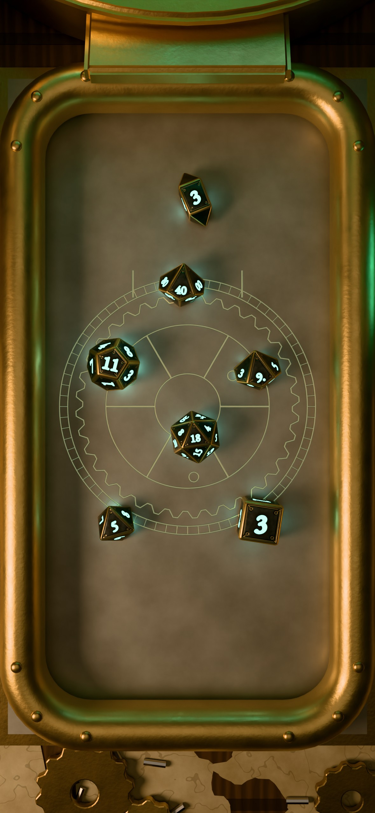

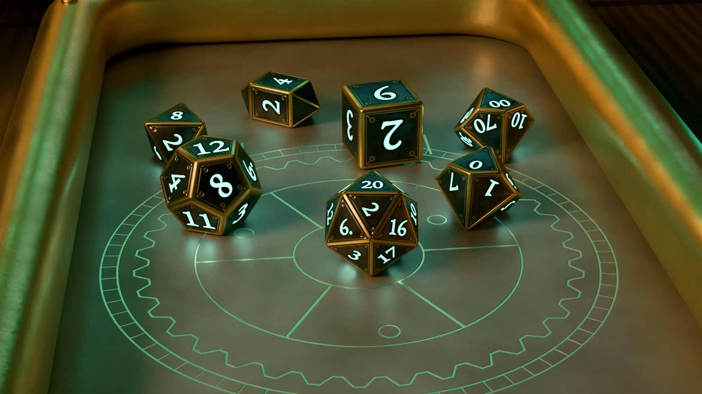

**Round 2.** Treatment: *glowing* — aqua-charged numerals in a dark
keyline; everything else on the dice is gunmetal and brass (the sigil
marks are brass now). The output plate is bright brushed steel with the
gear-and-orbit pattern inlaid in brass; the teal survives only as a
whisper in the grooves, the machine's core and tubes (all dimmed), so the
set reads brass-first. Strips: loose gears, screws and a schematic.

**Dice**:

- Machined gunmetal: brushed anisotropic streaks via bump; iOS drops
  anisotropy.
- Brass frames come from the atlas alpha.
- Numerals and **sigil marks** (inset ring, corner pads) are emissive
  teal.

**Environment: The Fate Engine.**

- A brass dice engine stands at the head of the tray:
  - a plinth, deck and crown
  - twin **glass charge tubes** filled with teal light
  - a gyroscopic cradle around a glowing core
  - gear trains, a pull lever and a blank nameplate
- The rolling area is its output tray: a dark steel plate engraved with a
  **gear-and-orbit pattern** whose grooves carry a faint teal charge,
  walled by a riveted brass rail.
- Workshop props: a teal-sand hourglass, tomes, a candle, calipers, maps
  and an armillary.

**Real time:**

- Dice and plate: emissive masks plus bloom.
- The engine is a baked prop mesh except for the tubes, which are
  emissive cylinders with **scrolling UVs**. The scroll needs E5c/E6;
  interim is an emissive intensity pulse via upsert, plus W18 bubbles.
- Gears rotate with plain node transforms: cheap, and they look alive.
- The core is an emissive sphere with an unshadowed teal point light.
- **Juice**:
  - Pulling the lever (or the throw gesture) drives the whole machine:
    gears spin up, the tubes surge, and the core flashes on a crit.
  - The dice drop from the chute, so the throw origin is fixed and
    diegetic.

### 3.5 Celestial Observatory: "a night sky caught in resin"

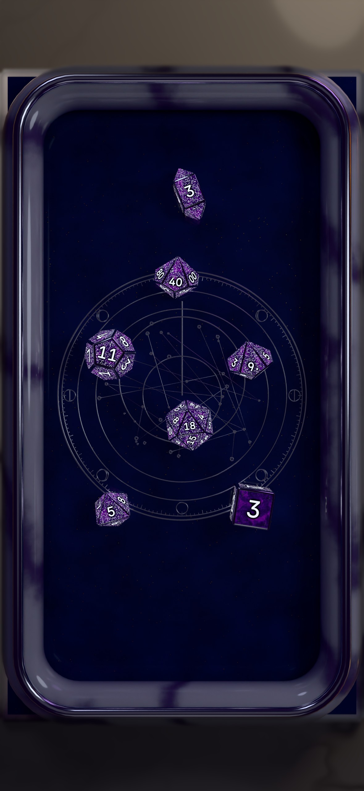

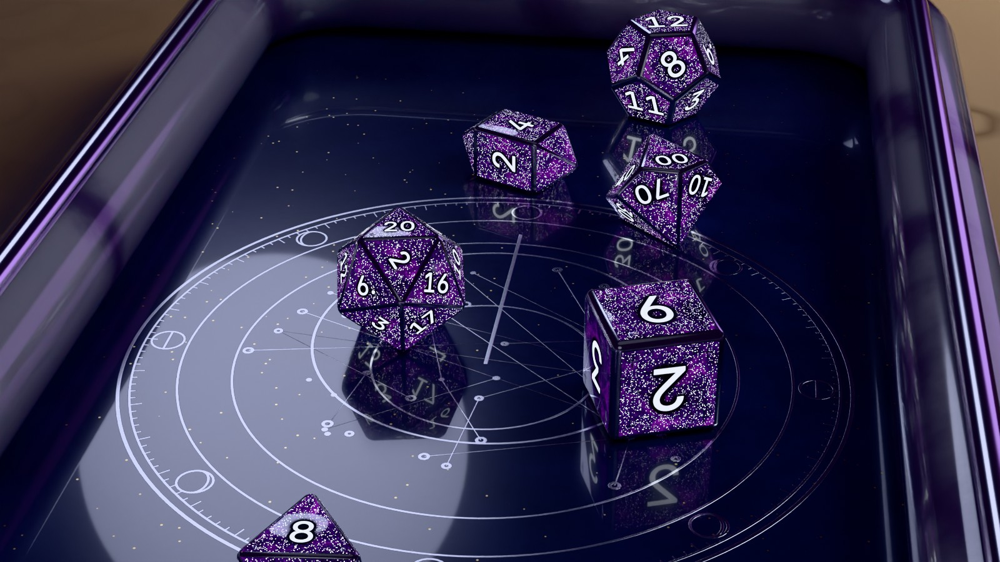

**Round 2.** Treatment: *glowing* — starlight-silver numerals in an
indigo keyline. The nebula is saturated indigo → violet → magenta with
cyan wisps and stronger glow (round 1 read grey-violet). Strips: a star
chart, a silver compass, loose amethyst.

**Dice**:

- Violet nebula resin: domain-warped noise with a violet ramp, faint
  emission in the brightest wisps, and pin-point star flakes.
- Silver edges come from the atlas alpha. Star marks are in G.

**Environment: The Star Balcony.**

- A veined marble table on a night balcony.
- The rolling field is dark lapis with gold flecks, inlaid with a silver
  **astrolabe**: an eight-phase moon ring, a 180-tick scale, an invented
  star chart and a rete ring.
- Amethyst clusters, a silver armillary, a star globe and a brass lantern
  sit around it.
- A marble balustrade stands in front of a violet star-dusted sky.

**Real time:**

- Bake the nebula into the dice atlas (baseColor + emissive): the 3D
  noise is baked per face cell.
- The star speckle is an emissive map.
- The sky is a low-res equirect or a sky card (E3 for a generated one).
- **Juice**: star streaks (trails) while dice fly; the astrolabe rete
  rotates to point at the result.

### 3.6 Hearthside Tome: "old bone, firelit"

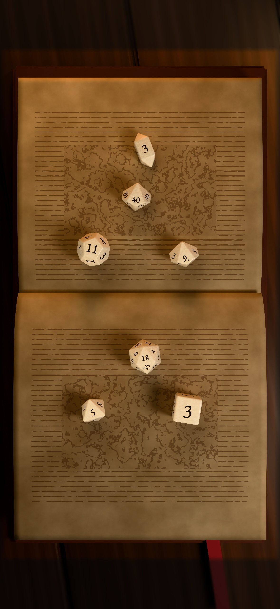

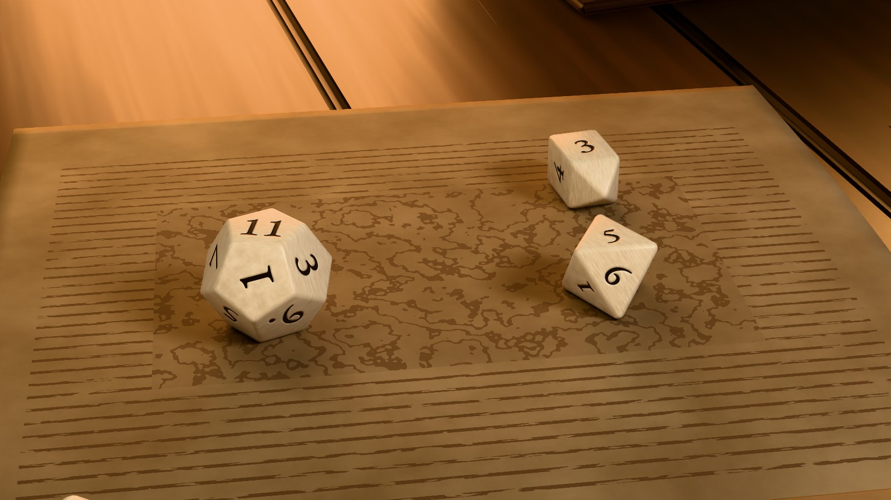

**Round 2.** Treatment: *inked* — engraved and filled with sepia-black
ink. The pages are tea-stained vellum a few steps darker than the bone,
and a side reading key (plus +0.7 exposure) keeps the bone bright, so the
dice separate. The top-down layout keeps dice off the gutter's slope
(the physics floor will be flat). The mug and the velvet pouch sit at the
top corners of the phone frame, wax seals at the bottom.

**Dice**:

- Bone and ivory: a grain along one axis, AO-darkened wear in the
  crevices, subsurface, a light coat.
- Sepia-inked engraved numerals.

**Environment: Fireside Reading.**

- The rolling surface is a **huge open tome**, spine across the screen
  (portrait-friendly). Its pages are bowed to the gutter, with ruled text
  blocks (abstract dashes, no words), an ink-wash plate and a ribbon
  marker.
- A hearth glows behind.
- Around the tome: a stoneware mug, a velvet dice pouch, wax seals,
  dried lavender and a candle.

**Real time:**

- The pages are one curved mesh with a single 2048² page texture.
- The tome's gutter dip must be reflected in the physics floor. Either
  use a flat collider (dice never reach the gutter), or accept a small
  lip.
- Fire glow is an emissive card plus a flickering warm light upsert.
- **Juice**: pages flutter (vertex animation or a card) on a crit.

### 3.7 Old Road: "wayfarer's gold"

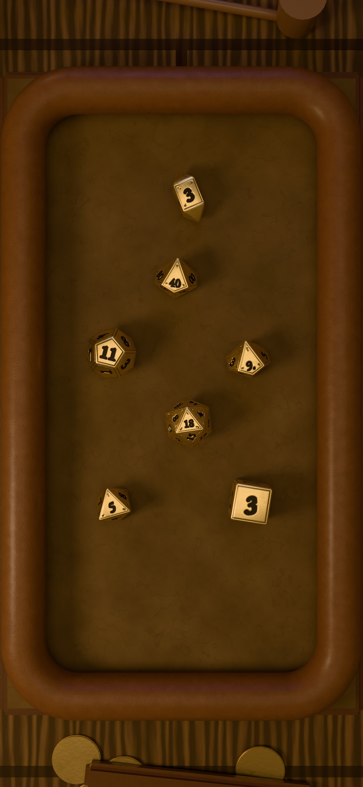

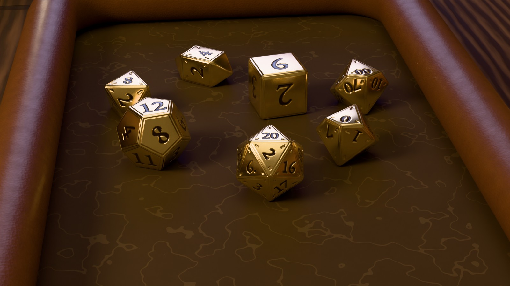

**Round 2.1.** Treatment: *enamel fill* — numerals cut crisp and filled
with oxblood-black enamel in bright, clean polished gold; the runes are a
shallow engraving only, and the map is darker and quieter (§0.5).
**Round 2.** Numerals were filled with black niello in bright worn gold. The gold needed a strong soft
overhead to read straight down (a top-down metal face mirrors the ceiling)
and a side key, and a warm dim room instead of black (most faces of a die
seen straight down mirror the room, not the ceiling); the map is now dark
tobacco vellum so the gold dice stand out. Strips: the clay pipe, coins and a sheathed knife.

**Dice**:

- Worn gold with AO-darkened recesses, noise wear and stretched-noise
  scratches.
- Numerals (EB Garamond) and flowing original **runes** are cut and
  filled with black niello.

**Environment: The Wayfarer's Table.**

- A weathered inn table.
- The rolling surface is a hand-inked **map of an invented land**,
  stretched inside a stitched-leather rim.
- A tin lantern, a clay pipe, a satchel and strap with a buckle, coins,
  bread and a wooden mug.
- A blue-hour window versus warm lantern light.

**Real time:**

- Standard PBR. The niello fill is the baseColor from the atlas.
- The lantern is an emissive glass plus one warm point light.
- **Juice**: the lantern flame gutters on a hard landing; dust puffs off
  the map.

### 3.8 Northfield Relay: "1986 lab hardware" (loop-era, original)

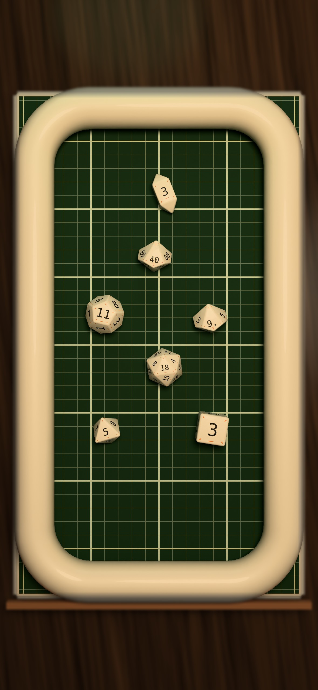

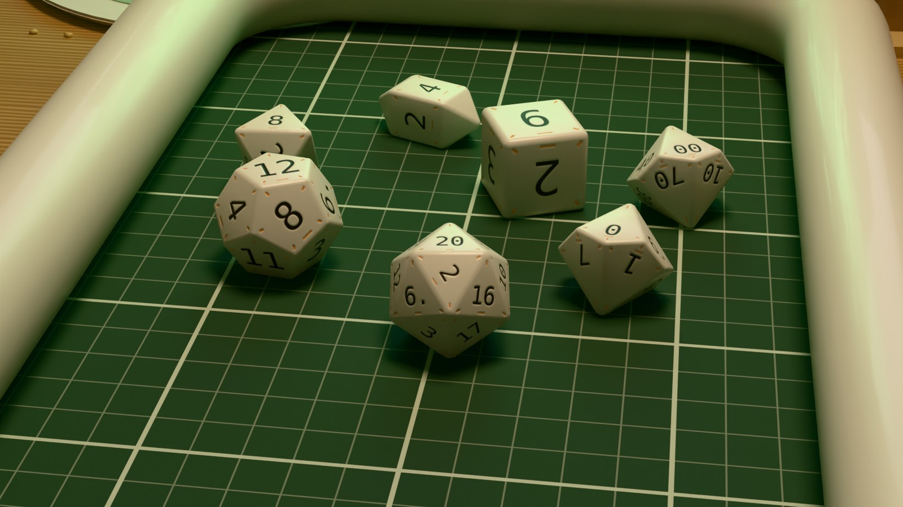

**Round 2.** Treatment: *inked* — near-black instrument print on the
warm-white ABS (round 1's orange print was 1.9 : 1); orange survives in
the calibration ticks. The environment is an actual 1986 kitchen table
seen from above: wood-grain laminate with an aluminium edge band, the CRT
terminal's keyboard at the head of the table, a stoneware mug of coffee on
a cork coaster, a plate with a toast crust and crumbs, the morning paper
(abstract columns and a photo block), a spiral notebook with pencilled
tallies and a yellow pencil, a pocket radio and a salt shaker, the teal
field instrument and a coiled cable. The pendant lamp now hangs behind the
top-down camera (round 1's shade blocked the view). The calibration mat is
dark green, so the white dice separate.

**Dice**:

- Warm-white ABS with slight subsurface and a fine texture.
- Numerals are orange instrument print (DejaVu Sans Mono), with teal
  calibration ticks and an index notch.

**Environment: Kitchen Table, 1986.**

- A 1980s farmhouse kitchen table: wood-grain laminate with an aluminium
  edge band, under a warm pendant lamp (round 2; see the note above).
- The tray is a beige instrument case lined with a dark-green rubber mat
  printed with a 1 cm / 5 cm calibration grid.
- A chunky CRT terminal glows green (scanlines, blocky text) at the head of
  the table, its keyboard in front; an odd teal field instrument with
  dials, toggles and LEDs.
- Breakfast things and paperwork: mug, plate and crumbs, newspaper,
  notebook and pencil, pocket radio, salt shaker; a coiled cable; a
  grey-blue dusk window.

**Real time:**

- All standard. The CRT screen is an emissive texture with a scanline
  scroll: interim is an upsert, with E6 or E10 (external texture) for live
  "terminal text" showing the roll log.
- **Juice**: the CRT prints the roll result; the instrument needle swings
  with the total.

### 3.9 Voltline: "black mirror chrome, neon-lit"

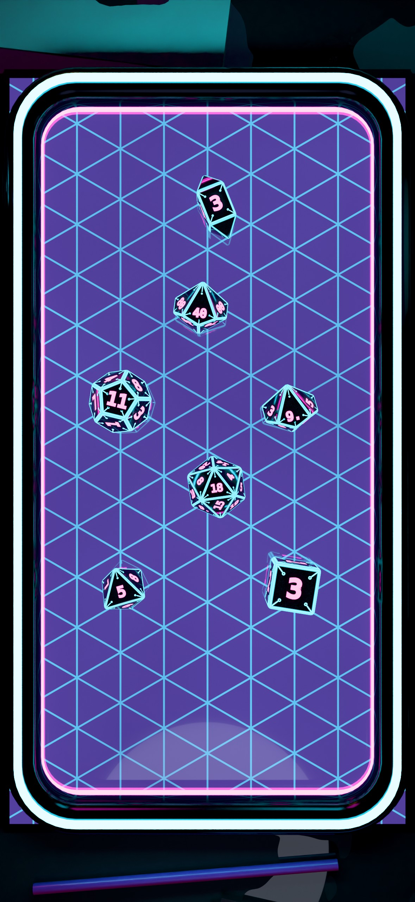

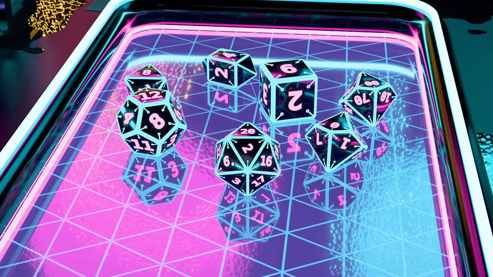

**Round 2.** Treatment: *glowing* — magenta neon numerals in a black
keyline, and a thin cyan neon line along every edge (the atlas's bevel
mask), so each black die keeps a lit outline. The holo tray is a lightbox
under smoked glass (a soft indigo glow everywhere); the chrome is darker
with less clearcoat so the slanted faces don't mirror the glow back.
Strips: a phone with a lit screen, a receipt, a straw.

**Dice**:

- Black chrome with a heavy clearcoat.
- Magenta emissive numerals and cyan **circuit-trace rims** (bevel border
  plus corner traces and pads in G).

**Environment: Rain Counter.**

- A late-night diner counter, wet with puddles (a roughness mask plus a
  clearcoat mask).
- The rolling area is a **holo tray**: smoked black glass with a faint
  pulsing triangular grid of light, a cyan neon rim tube and a magenta
  inner line.
- Rain-streaked window glass, with abstract neon signage outside (shapes,
  no words) and rain particles.
- A chrome napkin box, a paper cup and a phone.

**Real time:**

- Emissive plus bloom is the whole look, and it is fully supported.
- Wet reflections: on Android, screen-space reflections if Filament's are
  exposed; otherwise a planar-reflection fake. On iOS, `SCNFloor`
  reflectivity (E8 note) or rely on the clearcoat plus IBL of the neon.
- **Juice**: grid ripples from the landing point (emissive mask upsert,
  or E6 for a real ripple); neon flicker on a crit.

### 3.10 Vermilion Court: "urushi and gold"

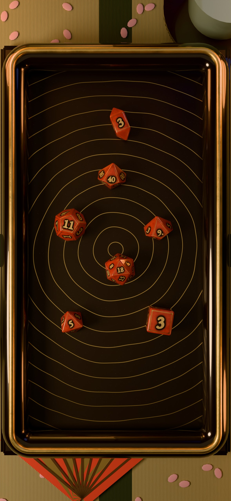

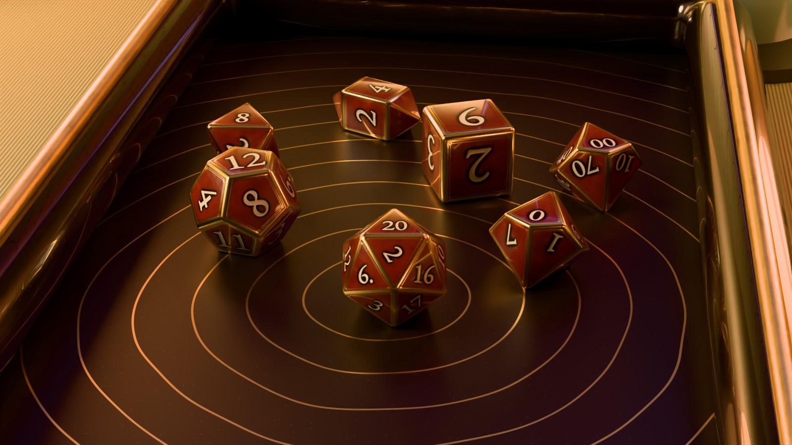

**Round 2.1.** Treatment: *bright metal* — pale gold-leaf numerals at a
medium weight on a deep urushi red, gilt edges (maki-e), a thin keyline
that the gate does not count (§0.5).
**Round 2.** Gold-leaf numerals (part diffuse, so they read straight down)
sat inside a heavy black-lacquer keyline on a brighter vermilion. The tray's black lacquer is satin rather than mirror (round 1
mirrored the lanterns as white discs), the moon no longer shadows half the
tray through the folding screen, the key comes from the side so its mirror
image misses the tray, and a paper-ceiling overhead lights the gold.
Strips: a folding fan, a celadon cup on a saucer, fallen petals.

**Dice**:

- Deep urushi-red lacquer with depth variation, a glassy coat (IOR 1.55)
  and sparse gold flakes.
- Gold-leaf numerals (EB Garamond) and double gold inlay borders with
  corner dots.

**Environment: Lantern Pavilion.**

- A black-lacquer shrine tray with a gold-dust wave pattern and a gilt
  rim, set on tatami.
- Paper lanterns at the corners and a folding screen with gold-leaf
  panels and painted waves.
- A celadon tea cup, and drifting petals.
- Ties to the M18 diorama palette.

**Real time:**

- Standard PBR plus clearcoat.
- Lanterns are emissive paper plus unshadowed warm point lights.
- Petals are W18 particles; flat sprites are fine.
- **Juice**: a petal burst on land; a lantern sway on a hard hit.

### 3.11 Gemcutter: "classic swirled gems"

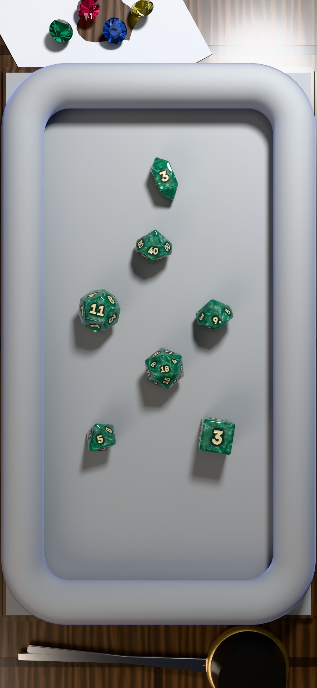

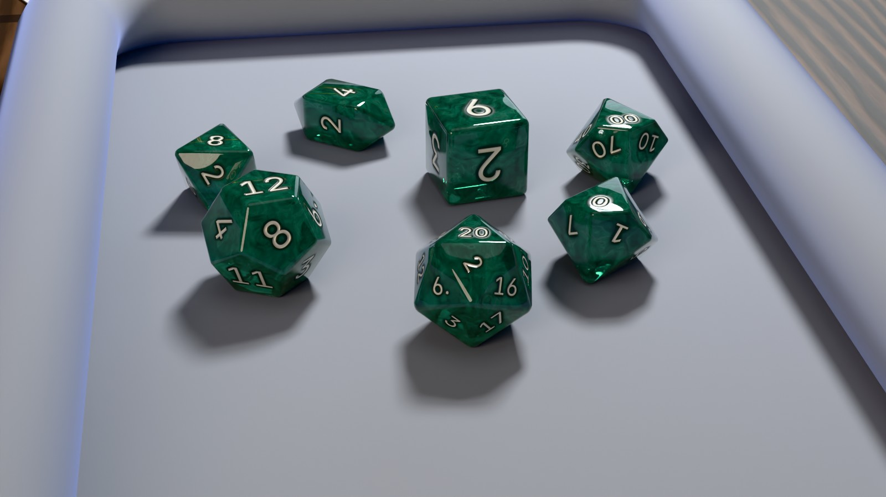

**Round 2.1.** Treatment: *bright enamel* — ivory-gold enamel numerals
at a medium weight; pale-jade wisps instead of pearl-white (§0.5).
**Round 2.** Warm-gold enamel numerals sat in a deep-green keyline. The swirl is a domain-warped noise
(deep emerald, jade ribbons, thin pearl wisps) instead of regular bands.
The tray velvet is a light jeweler's grey (round 1's teal matched the
emerald; at top-down under the daylight lamp it reads almost white, which
the operator may want a step darker — the gate allows down to ~0.3 grey). Strips: gem paper with loose stones, tweezers, the loupe.

**Dice**:

- Emerald-and-pearl swirl: distorted band noise, partial transmission,
  coat and subsurface.
- Gold-painted numerals.
- This is the classic polyhedral "gemstone" look, and the easiest to
  vary: swap the ramp for sapphire, ruby, amethyst or opal.

**Environment: The Jeweler's Bench.**

- A deep-teal velvet tray with a padded rim on a walnut bench, lit by a
  cool daylight bench lamp.
- A brass loupe, tweezers, glass-lidded gem cases with loose cut stones
  (an original brilliant-ish cut), gem papers and a brass balance.

**Real time:**

- Bake the swirl into baseColor. Android uses partial transmission; iOS
  uses alpha.
- Loose gems are low-poly glass with a high-contrast IBL.
- **Juice**: a loupe zoom on the result (camera dolly to the d20).

---

### 3.12 DartNative: "the logo in frosted glass" (example-app default)

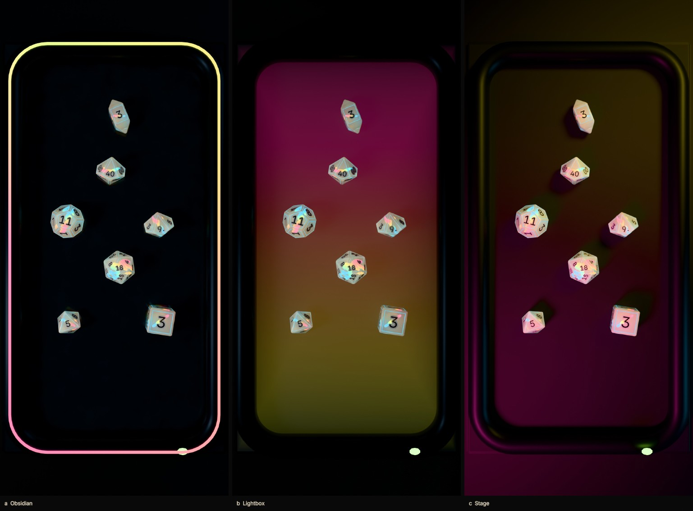

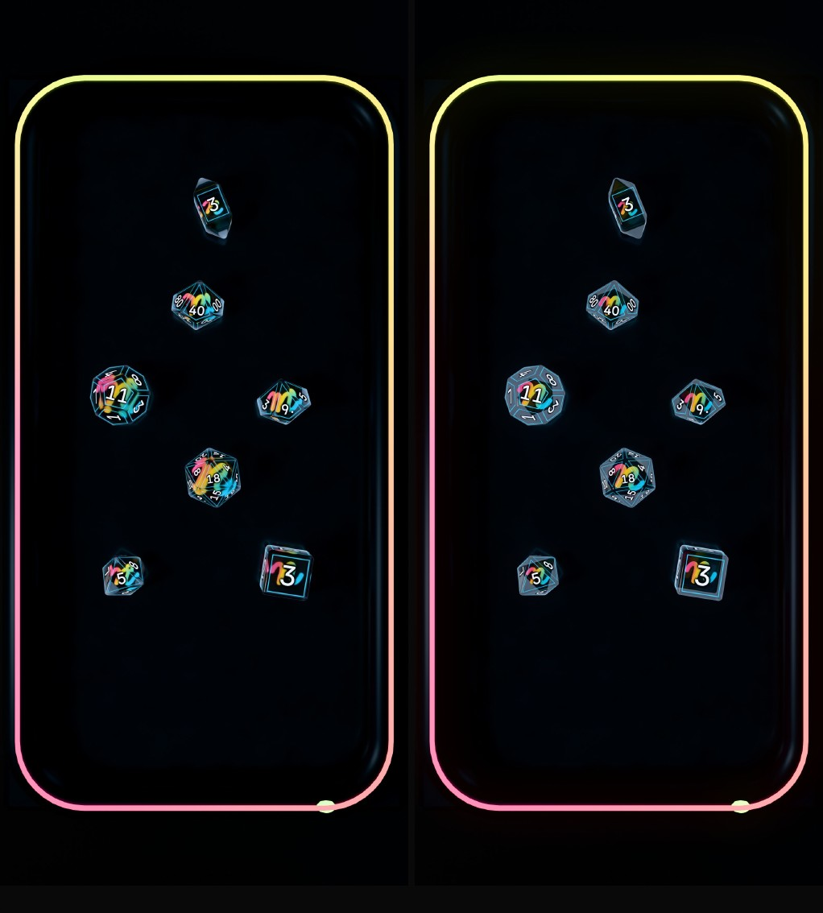

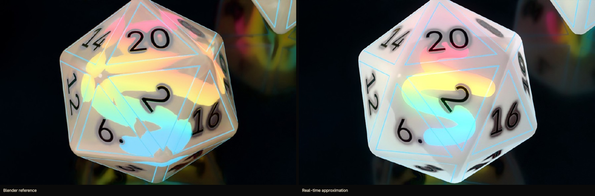

The dart3d example app's main dice experience (the eleven themed sets move
to the separate dice-roller app). Operator brief: the 3D DartNative logo
inside a frosted-glass set, so it appears suspended in the dice, and a nice
environment for it.

**Dice**:

- **Shell:** frosted glass, milky white. Reference: 40% rough transmission
  (roughness 0.1) + 60% diffuse white, a thin milky volume, clear coat.
  Real frosted glass reads milky-white under room light; the diffuse part
  is what gives the dark numerals a light ground, the transmitted part
  carries the logo's glow.
- **Logo:** the landed asset (`assets_src/dn_logo/dn_logo.glb`, the
  rounded-tube "n" with its gradient texture), imported as-is; its texture
  drives base colour *and* emission, so it glows its own brand gradient,
  softened by the frost. One per die at the centre, scaled to 0.78 × the
  die's inradius (half-diagonal), so it fills the core without touching the
  faces; the d4 shard gets the smallest one (its inradius is 0.65 cm).
- **Logo orientation — held level, facing the viewer.** A fixed inclusion
  would sit at whatever angle the roll leaves it, and a tube logo seen
  edge-on is a line. Held like a gimbal it always reads, the same on every
  result, and it is a small magic trick (it stays level while the die
  tumbles). Engine: a billboard/look-at constraint on the logo node
  (`SCNBillboardConstraint` on iOS; a per-frame rotation on Android). Each
  logo keeps a small random roll (±12°) so a set doesn't look stamped.
- **Numerals:** near-black enamel on the *outside*, opaque, Inter at its
  regular weight, with a thin band of denser (opaque) frost around each
  numeral. The gate does **not** count that band: the numerals pass on the
  plain frost around it, with the logo glowing behind. A thin cyan
  (#03C3F0) inlay line runs just inside each face.

**Environment options** (all #090E12-based; the brand gradient and cyan as
*light*, lime #A1EA5A once as a small "ready" light in the rim):

| Option | What it is | Verdict |
|---|---|---|
| **a · Obsidian** (recommended) | glossy obsidian tray, one thin brand-gradient light line along the rim | Calmest and most premium; the dice are the only bright objects; the rim line echoes the logo's gradient; cheapest in real time (one emissive tube, one key, a dim IBL). |
| b · Lightbox | frosted floor with the brand gradient glowing softly up through it | Striking, but the floor competes with the dice (it is the second-brightest thing on screen) and makes the white dice sit on colour. |
| c · Stage | dark matte stage, soft pink and gold pools from two spots, cyan rim | Moody and good for a hero or intro shot; at top-down the coloured pools tint the dice and pull the eye off-centre. |

**Real-time honesty.** Filament (Android) has rough transmission, so the
reference look is reachable there (thickness-based, no volume). SceneKit
(iOS) has no refraction: the approximation is a milky alpha-blended shell
(alpha 0.62, roughness 0.35) with a fresnel rim brightening, the logo as an
emissive core drawn *through* the alpha (sharper than the frost blur), and
a screen-space bloom (threshold 0.8). The `-rt` renders are exactly that
(`render_set.py --variant realtime`), measured by the same gate:
`dartnative-compare-{topdown,hero,d20,d4}.jpg` put them side by side. What
the phone loses: the frost's blur of the logo (it reads sharper and more
"inside a lens"), light scattered through the body, and the milky
self-shadowing; what it keeps: the milky shell, the glowing gradient logo,
crisp numerals.

**Readability** (full renders, 96 samples; the logo glows behind every
top-face numeral; frost band not counted):

| Render | Numeral vs plain frost, worst die (gate 4.5) | Die vs tray (gate 2.0) | Stroke / height | Result |
|---|---|---|---|---|
| a · Obsidian, Blender reference | 6.9:1 (d4) | 7.3:1 | 0.12–0.13 | PASS |
| a · Obsidian, real-time approximation (+ bloom) | 7.8:1 (d10u) | 11.2:1 | 0.12–0.13 | PASS |
| b · Lightbox | 5.9:1 (d4) | 2.9:1 | 0.12–0.13 | PASS |
| c · Stage | 8.2:1 (d4) | 8.3:1 | 0.12–0.13 | PASS |

Renders: `dartnative-a-{topdown,hero,d20,d4}.jpg` (reference),
`dartnative-a-rt-{topdown,hero,d20,d4}.jpg` (real-time approximation),
`dartnative-{b,c}-{topdown,hero}.jpg`, and the sheets
`dartnative-env-options.jpg` and `dartnative-compare-{topdown,hero,d20,d4}.jpg`.

**Juice**: the logo's emission pulses once on land and swells on a nat 20;
the rim line runs the gradient around the tray on the total.

---

## 3a. In the app: a play view that doesn't compete, and an intro per set

**Play view (all sets).** At top-down the dice must be the brightest,
sharpest, most saturated thing on screen. The stills already keep the
trays calmer than the dice; in the app add, outside the tray:

- a **vignette** (a screen-space darkening that starts at the rim, ~25–35%
  at the screen edges);
- **defocus** of the strips beyond the rim (DOF focused on the tray floor;
  props there sit 0–15 cm away from it, enough for a soft blur at the
  app's fov), or a baked blur in the prop atlas where DOF is too costly;
- **lower contrast and saturation** outside the tray (−20–30% in the prop
  atlas bake, or a post grade masked by the tray's screen rect);
- keep emissive props (candles, braziers, tubes, lanterns, neon, the CRT)
  below the dice's emissive level, and dim them further while dice are
  rolling.

**Cinematic intro (dice-roller app).** Side view exploring the environment
→ the camera flies to the table → top-down rolling. Good opening angles
per set (no renders yet):

| Set | Opening shot | What the camera passes on the way down |
|---|---|---|
| DartNative | low and close along the rim, the gradient line running toward camera in the dark | rises straight up over the tray as the rim line completes the loop |
| Emberforged | low behind the braziers, flames and sparks in the foreground, brick wall behind | over the anvil, down onto the molten channel ring |
| Frostbound | through the ice-crystal clusters, cave glow behind | across the snow-capped rim, down onto the ward circle |
| Arcane Study | candle flames in the foreground, the moonlit window behind, tomes and the armillary | over the runestone bowl and the letter, down onto the brass sigil |
| Fate Engine | in front of the engine: tubes, gears and the core at eye level | down the output chute into the tray |
| Celestial | on the balcony, star sky and amethysts, the armillary in silhouette | over the balustrade rail, down onto the astrolabe |
| Hearthside | from the hearth side, fire glow behind the open tome | across the mug and the pouch, down onto the pages |
| Old Road | from the window's blue hour toward the lantern | over the satchel and pipe, down onto the map |
| Northfield | at the CRT, green text scrolling, the pendant lamp above | across the keyboard and the mug, down onto the calibration mat |
| Voltline | through the rain-streaked window, neon signs outside | across the counter, down onto the lightbox |
| Vermilion | past a paper lantern toward the gold-leaf screen | over the fan and the tea cup, down onto the lacquer tray |
| Gemcutter | under the bench lamp, loupe and gem cases in the foreground | past the balance, down onto the grey velvet |

---

## 3b. Game rooms (round 4): the room around each tray

Each themed tray now sits in a full room: the establishing shot
(`<set>-room.jpg`, 1600x900) is the dice-roller app's intro opening, and
the room's light also reaches the tray in the top-down play view
(`<set>-topdown.jpg`), which render_set grades outside the tray (darker,
desaturated, softly defocused, `env_common.play_view_grade`) so the dice
stay the brightest, sharpest thing on screen. Visual targets:
`dart-native-explore-media/room-concepts/<set>-room.png`.

Rules for every room: never a single key. The tray and dice keep their
own lighting (key, rim, fill from round 2), and the room adds at least
three motivated sources from different sides (hearth, window, lamps).
Everything is built from the shared kit in `tool/dice_lookdev/room_common.py`
(shell with real wall openings, window, fireplace, hanging lantern,
pendant, sconce, paper lantern, neon bar, work table, shelves, bookcase,
cabinet, chair, barrel, beams); each `build_env_<set>.py` only composes it
in a `room(scene)` that returns the room camera. Render one with
`render_set.py --theme <set> --shots topdown,room --check`.

Round 2 (operator: "blocky, sparse primitives"): furniture and props are
now modeled assets in `tool/dice_lookdev/assets/` (one module per asset,
`build(name, loc, rot_z, **params) -> root`, shared procedural PBR in
`assets/materials.py`, turntable checks with `assets/preview_asset.py`;
see `assets/README.md`), built by Codex (gpt-6-astra) and art-directed
against the concepts. Each room is re-blocked from its concept: the tray
is shot broadside and carries the frame, table dressing frames it in the
foreground corners, and the room reads at mid-distance behind it.
All eleven: `dice-lookdev/all-rooms.jpg`; round 1 vs round 2 side by
side: `dice-lookdev/rooms-before-after.jpg`.

Round 3 (operator: "a big improvement"; finish the rooms). Pass 1 fixed
defects: the round recess cut into six tabletops behind the tray (it read
as a rendering bug; tables now have straight far edges), the dead dark
bands in Emberforged and Voltline, Frostbound's washed-out valley, and
gate headroom (Vermilion numeral 4.90 -> 6.19, Frostbound die vs tray
2.11 -> 2.54). Pass 2 was a second art-direction pass against the concepts
on Fate Engine, Hearthside, Old Road, Northfield, Vermilion and Gemcutter:
closer cameras so the dice read large, no plinth under the tray, denser
dressing at the tray's edges, stronger motivated light. Round 2 vs round
3: `dice-lookdev/rooms-r2-vs-r3.jpg`; interim: `all-rooms-r3-pass1.jpg`.

Lighting recipes (the tray lights are unchanged unless noted):

- **Emberforged — the smithy (round 2, the quality bar).** Shot broadside
  like the concept: camera out along −x, 40 cm above the table, 25° down,
  50 mm, f/8, the tray spanning ~78% of the frame with its near rim at the
  bottom edge. The tray sits on a 1.2 cm hammered forge plate on a heavy
  oak table (`oak_table`), dressed with a pewter goblet, a tooled
  leather mat and tome, a coin pouch, loose chain and a copper bowl of
  glowing ember crystals, all ≥10 cm clear of the rim. Behind, left to
  right: the arched forge (`forge`: hewn sooty ashlar, fractured coal bed
  with buried heat, layered flame tongues; its fire lights the arch and
  floor, 62.5 kW), the London-pattern anvil on a bark log stump, the tool
  rack, shelves of vessels, a bench with candles, a lantern and the fur
  hide, and the leaded window with the moon (18 kW, cool) at the back-
  right; three chain-hung cage lanterns (18 kW each) make pools on the
  back wall and a small one above the table (0.9 kW) adds a warm top
  light. Fill was cut so the light comes in pools (forge falloff, lantern
  pools, moon edge) and the corners fall into shadow; exposure −1.15.
  Round 3 pass 1: warm forge and lantern rakes reveal the oak grain on both
  sides; a small resting ball-peen hammer, oilstone, forged nails and leather
  offcut sit on the extended rear boards, at least 13.23 cm clear of the rim.
  Tray lights unchanged. Pass 1 preview gate (50% / 32 samples): numeral 4.70 (d4),
  Gate: numeral 8.53 (d12), die vs tray 2.20, stroke 0.121–0.130, PASS.

- **Frostbound — the frozen altar chamber (round 2).** Broadside, f/8,
  the tray spanning ~79% of the frame on the carved granite
  `stone_altar` with `snow_cover` on every ledge. Left: bronze
  `fire_bowl`s on frost-rimed pedestals (the warm key; curling flames
  over coals) and candles; behind, carved `frost_pillar`s, blue
  `winter_banner`s with gold snowflake embroidery and the `frozen_arch`
  onto the `glacier_vista` (peaks, bridge, frozen cascade) with
  `cold_mist` at its foot and sparse flakes. Right: a big fractured
  glowing `ice_formation` (the cyan accent and rim) with a bronze
  armillary on a pedestal. Round-1 lesson kept: die vs tray was at the
  gate (2.01), so bright ice reflections stay off the tray floor and the
  dice get a cool back rim. Round 3 pass 1 lowers the distant vista in the
  arch sightline, with a brighter sky gap, less snow on near rock, four
  progressively lighter ridges, a readable stone bridge and a separately
  lit frozen cascade. Mist is restricted to low banks at the foot. Distant
  decorative ice and mist are excluded from glossy reflections.
  Dice-only room returns increase the low glacier bounce from 12 to 26 kW
  and the overhead sky reflection from 1.9 to 7 kW; a 10 kW opposite-side
  ice return fills the dark facets. These lights exclude the tray and room
  surfaces, increasing die separation without brightening the tray floor.
  The original tray lights and tray/dice materials remain unchanged. Full-resolution
  default-160-sample gate: numeral 5.51 (d6), die vs tray 2.54 (up from 2.11),
  Gate: numeral 5.51 (d6), die vs tray 2.54, stroke 0.121–0.130, PASS.

- **Arcane Study — the night study (round 2).** A closer
  oblique broadside view looks down 35.2 degrees, using 20.4 mm at effective
  f/8. The tray spans 84.6% of the frame with its near rim cropped at the
  bottom. One planked oak desktop replaces the separate box-shaped returns;
  its straight worn far edge now runs continuously in front of the separate
  lower armillary instrument table (round 3, pass 1).
  Heaped navy velvet, larger gold stars, candles, inkwell, blue runestones,
  gilt leather books and a pierced brass censer bring the dressing together
  on the main desktop. The armillary stays on the lower table behind it.
  Carved bookcases and the moonlit Gothic window remain legible above.
  Stronger candle pools lift the warm mid-tones; two linked reflections
  warm the existing brass floor and rim cap. Exposure remains -0.15 EV;
  the tray shaders, geometry and original lights are unchanged. Bright
  dressing and cloth clear the rim by at least 10.37 cm.
  Pass 1 preview gate (50% / 32 samples): numeral 5.20 (d20),
  die vs tray 5.01, stroke 0.124–0.130, PASS.

- **Fate Engine — the inventor's workshop (round 3, pass 2).** A closer
  broadside 15.5 mm camera at effective f/8 keeps the d20 fully in view at
  7.5% of image width; the near rail is cropped below the frame. Focus stays
  on the dice. The continuous oak desktop is raised to z=0.305 beneath the
  unchanged z=0.31 steel surface, hiding the projecting support-board edge. A shallow hidden bedding cut
  accommodates that unchanged base within the desktop.
  The far table edge remains straight, without a recess.
  A separately supported, riveted brass casting dominates the rear centre:
  bolted mouth jambs, a sloped outlet, reinforcing crown hoops, exposed piston
  rods and the phased involute gear train. The extended chute clears the rim
  by 12.9 cm and visually aims into the tray. The glass induction column is
  separated from the gears on the right, beside a connected pressure dial
  and a flanged receiver with two more gauges. The caged work lamp and the
  larger armillary overlap the left midground. Drawing sheets, a magnifier,
  caliper, dividers, hexagonal pencils and loose hardware frame the bench.
  Evaluated support placement seats the tools on the oak or curled paper;
  minimum measured foreground clearance is 10.44 cm.
  The closer Gothic window retains its existing spired-city geometry; its
  sightline is raised and the distant window emission reduced. Warm lamp
  pools and smaller brass highlights replace stronger broad returns. A
  3.5 kW warm reflection and a 4.8 kW teal reflection illuminate only the
  existing tray field and rail. Room lights retain separate environment
  receivers. The tray geometry, materials, engraving and original light
  calls are unchanged; exposure remains +0.1 EV. No room-wide volume.
  Pass 2 preview gate (50% / 32 samples): numeral 14.11 (d10t),
  die vs tray 2.59, stroke 0.124–0.130, PASS.
  Gate: numeral 13.79 (d10t), die vs tray 2.49, stroke 0.124–0.130, PASS.

- **Celestial — the observatory loggia (round 2).** Broadside from −x,
  38.5 mm, f/8, low seated height so the tabletop is a narrow band. The
  tray on a pale, warm, fine-veined polished `marble_table` (slim base,
  no dark plinth). Left: the brass `lantern` (the warm key, a visible
  pool on the marble), books, the `armillary`, the brass refractor
  (`telescope`) on its tripod angled up at the sky, a violet
  `velvet_drape` with gold stars and a brass astrolabe cropped in the
  corner. Right: a celestial globe, an `amethyst_cluster` bowl (the violet
  accent, shadowless glow), the magnifier and the parchment star chart
  (`astronomer_tools`). Behind, the `marble_loggia` arches frame
  `night_vista`: the round-1 sky was a harsh saturated purple wall; now a
  blue-black to indigo sky, a desaturated violet-blue galaxy band, dense
  stars with a few glints, a big detailed moon and a small planet, a
  moonlit cloud sea and the floating spired citadel with warm windows.
  Tray lights unchanged (moon 22 kW cool from the back, violet rim, soft
  front); a cool return on the chart and a warm return on the marble
  base; exposure −0.5. Gate: numeral 14.31 (d12), die vs tray 2.21,
  stroke 0.121–0.130, PASS.

- **Hearthside — the fireside reading nook (round 3, pass 2).** A close
  broadside view makes the foreground d20 9.8% of the image width. The
  preserved open tome fills the lower frame, with its near binding cropped;
  it rests directly on a complete oak table with a straight far edge. The
  20 mm camera is 13 cm above the table, looking down 19.9 degrees at
  effective f/8, focused between the foreground dice. This is a lower,
  tighter crop than the concept, chosen to keep the dice large while
  showing the fireplace arch and chair above the tabletop.
  The fieldstone hearth uses rounded irregular stones, deeply recessed
  mortar, soot-dark voussoirs, charred logs and broader overlapping flames.
  The leather wing chair has modeled button depressions and creases,
  a tartan cushion and a wine-red knitted throw over the front arm. A
  stepped sitting bay supports the chair and its side table. Local warm
  fire returns illuminate the stone, leather and book spines, with cool
  rain-window light behind; the fire core is 85 kW.
  Corner dressing groups a violet glass brass lantern, a tall dripping
  pillar candle, lavender, an amethyst bowl on a velvet pad over gilt
  volumes, the velvet pouch, and coffee beside stacked books. Loose lavender
  and biscuit crumbs sit near the mug. Darker oak, scratches and broken
  cup rings catch the candle and hearth reflections. The original `fire`,
  `cool_fill`, `reading_key`, page shader, open-book geometry, ribbon and
  top-down layout remain unchanged. Room lamps retain their receiver
  collections; the ivory/vellum candle returns, exposure +1.15, gamma 0.8
  and 0.5 px reconstruction filter are preserved.
  The minimum measured main-prop clearance is 10.34 cm from the book cover.
  The room remains softer and more tightly cropped than the concept;
  the rainy village and lavender are secondary details at half resolution.
  Pass 2 preview gate (50% / 32 samples): numeral 4.60 (d10t),
  die vs tray 3.50, stroke 0.123–0.129, PASS. Final room: 50% / 64 samples, 5 s rendering, 10.02 s total command. All ten
  other approved rooms were rebuilt at 25% / 16 samples and visually compared
  with their earlier previews; no appearance regressions were found. Logs,
  asset close-ups and geometry audits are in `out/r3/pass2/hearthside/`.
  Gate: numeral 9.21 (d4), die vs tray 3.41, stroke 0.123–0.129, PASS.

- **Old Road — the wayfarer's inn corner (round 3, pass 2).** The close
  broadside 19.5 mm camera looks down 26.1 degrees at effective f/6.3, focused
  on the dice. The d20 spans 8.2% of the frame; the near rim and near corners
  are cropped. This is a more aggressive crop than the concept, and should
  not be described as the whole tray occupying 85% of the frame.
  The oak table has a shorter continuous straight far edge and a worn,
  dark open-grain finish, with broken cup rings and knife marks outside the
  quiet band. Its top is at z=0.34 cm, immediately under the original map at
  z=0.36. A concealed bedding cut in the table accommodates the unchanged
  leather board; there is no rear recess or projecting plinth.
  A brighter, wider oil flame is visible inside the iron hurricane lantern.
  Folded red plaid has crossed yarn relief and split resting fringe, with a
  briar pipe on it. The compact canvas/leather pack is closer on a supported
  chair landing, with a dark green bedroll and a high tin cup whose thong is
  anchored to the bedroll cinch. The bound staff, dark rugged fieldstone log
  fire, sheepskin stool and side-table candle complete the sitting bay.
  The smaller pewter tankard has moved to the side table; the loaf and
  trencher are reduced to 18 by 12 cm. The village has quieter roof contrast,
  dimmer window pinpoints and a less saturated blue-hour sky. Its simple roof
  shapes remain more stylised than the concept; the blanket fringe and fur
  stool are also less prominent in the establishing shot.
  The lantern rakes warm light over the oak, the log hearth supplies the
  warm counterlight, and dusk supplies the cool return. Two broad room fills
  are removed and the remaining room lights use environment receivers.
  The original map, leather board/rim/materials, `blue_hour`, `warm_key`,
  overhead and existing 2 kW gold reflection return remain unchanged.
  No dark ceiling beam crosses the gold dice's reflection field. Exposure
  remains +1.5 EV, gamma 0.8, and the Cycles filter remains 0.5 pixels.
  Audited foreground dressing clears the board by at least 11.28 cm, with
  no prop intersections and no die/room contact errors. All ten other
  approved rooms were rendered serially at 25% / 16 samples and visually
  compared without visible shared-asset regressions. Final previews and
  asset close-ups are in `out/r3/pass2/oldroad/`. The room at 50% / 64 samples
  takes 5 seconds to render (7.61 seconds for the command, using verified
  cached numeral atlases and MetalRT).
  Pass 2 preview gate (50% / 32 samples): numeral 5.45 (d10t),
  die vs tray 3.29, stroke 0.123–0.128, PASS.
  Gate: numeral 5.81 (d4), die vs tray 3.15, stroke 0.123–0.128, PASS.

- **Northfield — the 1986 countryside kitchen (round 3, pass 2).**
  A closer broadside crop, 21.5 mm and effective f/8, makes the foreground
  d20 about 8% of the frame width. The camera is 23.4 degrees down; the near
  rim and side corners are cropped. The thin chair-back arc is removed to
  reveal the cooker and keyboard. The continuous laminate top has a straight
  far edge and is raised to z = 0.33, immediately below the original mat at
  z = 0.36. A concealed bedding cut in the table follows the existing ABS
  base; no tray object or tray material is altered.
  Figured walnut print, varied sheen, worn scratches, a broken cup ring and
  small breakfast crumbs replace the uniform stripe treatment. The floral
  mug and toast sit on the table; an open cotton crochet placemat frames the
  right. Its 10.83 cm clearance is the nearest foreground dressing to the
  tray. Evaluated geometry checks verify support and no foreground prop
  intersections. The terminal stands farther back with its separate keyboard
  visible, a true cabinet recess behind the bowed glass, phosphor scanlines,
  darker screen edges and green spill across the mug and laminate.
  The orange pendant has an optional glowing opal diffuser. A tighter warm
  table pool and cupboard strip contrast with restrained blue window light;
  two broad fill lights are removed. The original `lamp`, `dusk`, `crt_glow`
  calls remain unchanged and the room lights retain separate receivers.
  Raising the kitchen bay exposes the patterned tile splashback, enamel
  cooker, steel stockpot, kettle and hanging skillet/ladle/turner. Plants,
  floral curtains and radiator surround the casement. The existing field
  view is repositioned: a gap in the spruce stands exposes the three-legged
  machine, with a smaller red barn beside it. No broader backdrop replacement.
  Shared extensions are opt-in; all ten other approved rooms build and were
  visually rechecked at 25% / 16 samples. Asset close-ups and delivery renders
  are in `out/r3/pass2/northfield/`. No volumes or external assets.
  Exposure is +0.4 EV, reduced from +0.7 to retain thin ink contrast; gamma
  0.7, the 0.2-pixel phone filter and the room's 1.5-pixel filter are unchanged.
  Adding more direct light reduced numeral contrast, so that trial light was
  removed. Pass 2 preview gate (50% / 32 samples): numeral 5.09 (d20),
  die vs tray 6.06, stroke 0.124–0.132, PASS. These are preview measurements;
  the full-resolution gate remains for the operator's final render.
  Gate: numeral 9.90 (d6), die vs tray 5.94, stroke 0.124–0.132, PASS.

- **Voltline — the late-night diner (round 2).** Broadside from −x,
  54 mm, f/8 on the dice, seated eye height. The holo tray on a wet
  laminate window counter (`diner_counter`: chrome trim, water beads that
  catch the neon, a clean margin round the tray), framed by a chrome
  napkin dispenser and a fluted salt shaker (left) and a diner mug with a
  faint steam wisp and a leather menu (right). Behind, the `rain_window`
  (clear glazing with separate droplets and run trails: the round-1 rain
  normal smeared the street into blobs) onto `neon_street`: layered
  façades with varied window grids, the ringed-planet, ring, bar and
  chevron signs (`neon_sign`), parked cars with tail lights, a wet road
  with streak reflections. To the left the diner recedes: service bar,
  tufted red `bar_stool`s, a back bar of bottles, `espresso_machine`,
  `pie_stand`s, warm `dome_pendant`s (85 kW) in depth. Round 1 was too
  dark: the street emission and the warm bar light were raised (bar
  strip 850 kW, back-bar warmth 700 kW, cyan through the rain 115 kW,
  plus small counter glints), exposure +0.2. Round 3 pass 1 includes the
  countertop in the neon reflection receivers, alongside its water beads
  and streaks. A formed spoon on a ceramic saucer, folded cotton napkin and
  unprinted sugar sachets sit at least 12.55 cm from the rim. Tray lights unchanged.
  Pass 1 preview gate (50% / 32 samples): numeral 12.68 (d20),
  die vs tray 4.27, stroke 0.124–0.132, PASS.

- **Vermilion Court — the lantern pavilion.** Round 3 pass 2 uses a
  close broadside 26 mm camera, 32.6 degrees down, at effective f/8.
  The near rim is cropped; the d20 spans 7.4 percent of the frame,
  larger than the previous shot but still below the concept's 8–10 percent.
  The continuous 112 × 47 cm lacquer tabletop now reaches z=1.12.
  A fitted bedding cut in the table follows the original tray base,
  concealing its projecting board without changing the tray's position,
  mesh or materials; the far table edge remains straight. The lacquer
  uses an optional higher-polish coat and reflects a modeled ceiling
  paper lantern. Smaller blossom-decorated tea bowls and a caddy frame
  the rear corners. Cupped petals rest on the table and drift beyond the
  play area. Evaluated foreground dressing clears the tray by at least
  10.41 cm, with no prop intersections.
  A separate gold blossom applique follows the tray's outer wall; the
  original rim, gilt, floor and engraving are untouched. Bound tatami,
  a silk zabuton and a low stand occupy a raised seating platform.
  The closer gold-leaf screen has painted blossoms over the existing
  pine/cloud brushwork. Warm andon pools, a red chochin, shoji, a
  carved stone garden lantern, flowering branches, a vermilion railing
  and a clouded dusk pagoda view form the upper layers.
  Broad neutral fill and the hard cool area-light reflection are removed.
  A receiver-linked warm strip lights the existing gilt and table without
  illuminating the red dice faces. The pass-1 key, moon, overhead and
  paper/dusk return calls stay unchanged. A new 2.2 kW diffuse-only warm
  andon edge return, linked to the dice, raises die/tray separation from
  2.40 to 2.53 while keeping every numeral above 6. Exposure remains
  +1.3 EV. No volume, external assets, lettering or renderer changes.
  Optional shared polish/blossom parameters preserve previous defaults;
  all ten other approved rooms were re-rendered serially at 25% / 16
  samples and visually checked. The background remains more cropped
  and simpler than the concept, and some clear tabletop band remains.
  Gate (full resolution, 128 samples): numeral 6.19 (d12), die vs tray 2.53,
  stroke 0.123–0.128, PASS. Previews: `out/r3/pass2/vermilion/`.
  Gate: numeral 6.19 (d12), die vs tray 2.53, stroke 0.123–0.128, PASS.

- **Gemcutter — the jeweler's atelier.** Round 3 pass 2 brings the room
  camera closer: 21.5 mm, 23.1 degrees down, effective f/8 in centimetre
  units, focused on the dice. The near rim is cropped; the d20 spans 7.8
  percent of the frame. The straight walnut bench top is raised to
  z=0.402 cm, immediately below the original velvet plane at z=0.410,
  concealing the projecting walnut base without moving the tray. The tray
  geometry, materials and all four original light calls are unchanged.
  Open compartmented cases flank irregular spills of diamonds, emeralds,
  sapphires, rubies and champagne stones in brilliant, stepped, oval, pear
  and cushion cuts. Their sharp facets use varied IORs and sparse coloured
  glints. A handheld optical loupe, mounted loupe, resting gravers and
  tweezers frame the left, with a rough beryl cluster on velvet and a
  turned brass pedestal. The right carries an emerald lantern, drawer
  chest and rack of gravers and pivoted pliers. The larger articulated
  daylight lamp and centred balance stand on a supported rear bench;
  separate working heights keep their silhouettes visible. The nearest
  instrument clears the rim by 10.6 cm in plan; a mesh intersection audit
  covers the cases, loose stones and tabletop instruments.
  Scored grain, oil marks and curled filings stay outside the play margin.
  The enlarged mullioned casement has layered slender spires, a warm sunset,
  sill greenery and candles. Cool task light, amber sunset pools and an
  emerald accent light environment receivers; an additional grazing room
  light reaches only the unchanged velvet floor and rim. The room uses
  +0.25 EV / gamma 0.95 and a 1.5-pixel filter; top-down retains +0.85 EV /
  gamma 0.75 and the 0.3-pixel phone filter. No dice material, tray material,
  renderer or gate changes. Velvet fibre detail remains limited by the
  protected material; the distant skyline is deliberately soft.
  Shared additions preserve existing defaults: `cut_stone` gains an IOR
  parameter, `cut_gem` gains optional cuts/glints, and `atelier_window`
  gains spire and altitude controls. All ten approved rooms are checked
  serially at 25% / 16 samples after these changes.
  Pass 2 preview gate (50% / 32 samples): numeral 5.39 (d20),
  die vs tray 3.56, stroke 0.121–0.130, PASS.
  Gate: numeral 6.82 (d20), die vs tray 3.39, stroke 0.121–0.130, PASS.

## 4. dart3d features to verify (before building these for real)

1. **Emissive intensity > 1 + bloom threshold** on both platforms, and
   emissive *texture* support. Check that SceneKit `emission` takes a
   texture and an intensity.
2. **Material upsert rate**: 10 Hz emissive and colour animation on 7
   dice plus the environment without hitches on the A142 (W22 lane).
3. **Transmission on Android** (Filament refraction mode and thickness)
   and the **iOS alpha fallback**. Check the look of a dark shell over an
   emissive core on iOS.
4. **Nested meshes per die** (shell + core, parented) under one rigid
   body. Check that the physics collider is only the outer hull.
5. **Internal alpha cards** (the frost fractures): sorting inside a
   transmissive shell on both backends.
6. **Clearcoat** (both) and anisotropy (Android only). Check that
   iOS's loss of anisotropy is acceptable for Fate Engine and steel.
7. **KTX2 UASTC normal maps** on both, and a 4-texture material per die
   set.
8. **Unshadowed point lights**: per-light shadow toggle and the light
   count budget (3–4 small lights plus one shadowed key).
9. **Fog** or an equivalent for the "mist cards" fallback.
10. **Particles**: W18 one-shot bursts on iOS (bursts are ignored today,
    per §3.5). Ember burst, frost puff and petals need either a burst
    workaround (a short high-rate emitter) or an iOS fix.
11. **Flipbook sprites** (E5b) for candle and brazier flames. Interim:
    crossed emissive cards.
12. **Node transform animation** (gears, rete, lantern sway) at 60 Hz
    from Dart without per-frame payload churn.
13. **Transparent SceneView (X1)** is *not* needed. Every environment
    here is in-scene, which sidesteps X1 and D6.

---

## 5. Readability in real time: remaining risks

The gate is measured on offline renders. What can break it in the app:

1. **Glowing numerals = emissive mask + bloom.** The numeral colour and
   the emissive map come from atlas R (per-set colour, strength 3–9 in the
   stills). Bloom spreads that light *into the keyline*, which is exactly
   the ring the gate measures, so the contrast drops as bloom rises. Keep
   the bloom threshold above the dice's emissive level (bloom the
   environment, not the numerals), or cap bloom radius below ~0.1 face
   inradius at phone scale; re-measure on device screenshots (below).
2. **Keyline via texture.** Bake halo R into baseColor (dark ring) and
   zero the emissive there. At 2048² the keyline is ~12 texels wide on a d20
   face; ETC1S can smear it into the numeral. Use UASTC for the colour map
   of keyline sets, or keep the keyline in its own channel (e.g. roughness
   texture alpha) and darken in the shader once E6 lands.
3. **Top-down metal needs something to mirror.** Old Road, Vermilion,
   Gemcutter, Arcane and Celestial rely on a soft overhead source. In real
   time that is the zenith of the environment map (E3) or a large
   unshadowed directional fill; with a dark IBL the gold goes dark again.
   Part-diffuse numerals (Vermilion, Gemcutter) are the fallback that does
   not depend on it.
4. **Specular hotspots.** A key light near the camera axis puts its
   highlight on the top faces. The in-app sun preset (el 46.8°) is fine;
   a "lamp mode" light dragged over the tray (E5/V3) is not. Clamp the
   lamp's elevation or lower clearcoat on keyline sets.
5. **Glass dice (Emberforged, Frostbound).** The stills mask back-facing
   glyphs. In real time back faces are culled (fine), but Filament's
   refraction samples the scene behind the die, and the iOS alpha fallback
   blends it: a bright floor under clear ice lowers contrast again. The
   keylines carry the gate there (the plain-body ratio for Frostbound is
   the honest worst case).
6. **Tone mapper parity.** The numbers are for Khronos PBR Neutral. If
   dart3d ships ACES or plain clamp, emissive numerals and pale gold clip
   differently; pick PBR Neutral for the dice scenes or re-tune.
7. **Screen size.** Measured on a 1179 px wide frame: the smallest numeral
   is ~22–27 px (the d20's two-digit numbers, ~1.4 mm on a 460 ppi
   phone). A smaller phone or a zoomed-out camera goes below that; don't
   let the camera fit show more than tray + ~1 cm.
8. **Verify on device.** The check reads any PNG plus the mask pass. The
   next step is to run the same measurement on simulator/device
   screenshots of the real app (the mask pass can come from a debug
   material override), so the gate covers the real renderer too.


---

## 6. Open points for the operator

- **Pick** which environments go to production first. Suggested:
  Emberforged → Frostbound → Arcane Study → Fate Engine, matching the
  batches.
- **Keyline weight**: the keylines are generous (~0.2 face inradius) so
  the gate holds with margin. On Vermilion and Gemcutter they read as a
  bold outline in close-ups; a thinner keyline still passes on most sets
  if the operator prefers a finer look (it's one number,
  `build_atlas` → halo).
- **Die size vs screen**: dice are 1.3× the round-1 size (in-app size).
  A tablet shows more of the environment around the walls (the props are
  modelled for that).
- The *final* dice for the app come from this script (`--export-glb`),
  then the fsceneb conversion. Baking of procedural textures (nebula,
  swirl, fire) into the atlas is the next tool step (a `--bake` mode), not
  done in this pass.
