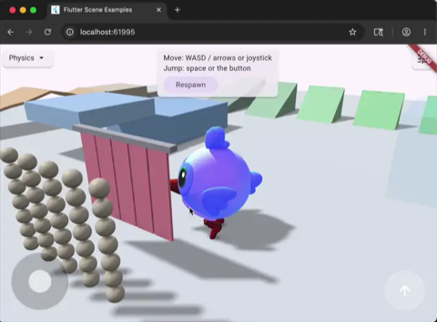
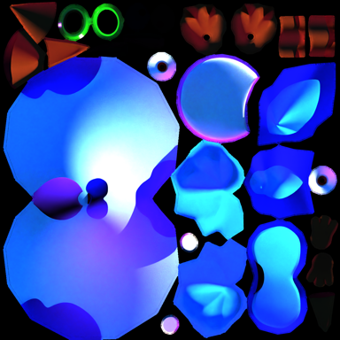
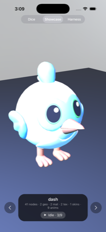
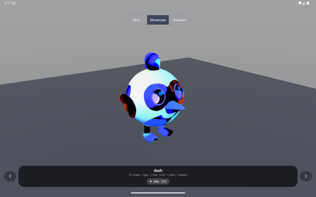
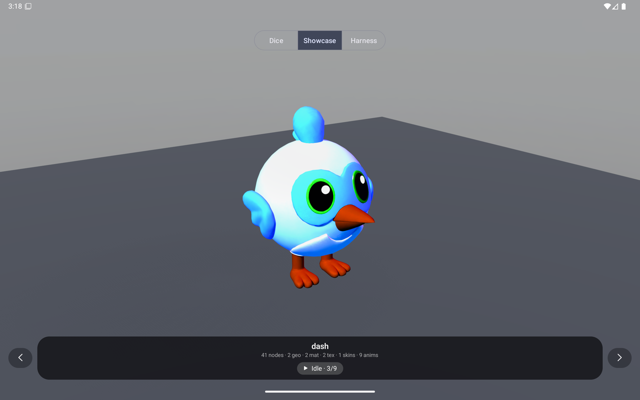
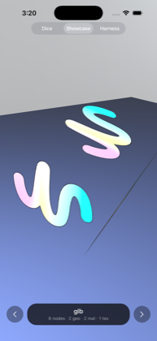
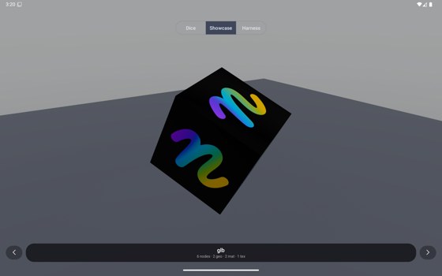
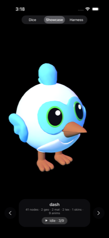

# Investigation: Dash renders with wrong materials on Android

Date: 2026-09-28 · Branch: `investigate/dash-materials` (off `origin/stabilize/hygiene`)
Operator report: "the bird model does not look correct … it looks completely different from iPhone."

## Verdict

**Root cause (verified): Filament flips V on every Android dart3d material.**
The runtime material builder never calls `MaterialBuilder.flipUV(false)`, and
Filament's default is `flipUV = true`. So the generated vertex shader rewrites
`v → 1 − v`. dart3d's wire UVs are glTF-convention (V = 0 at the top of the image),
and `TextureFactory` uploads the top row first, so every texture lookup on Android
reads the image upside down. On Dash, the beak and feet sample the blue body region,
the wings sample the orange beak/feet islands, and parts of the body land in the black
gutters of the atlas. It is a texture-mapping bug, not a lighting or colour bug.

Confidence: high. With the rows of the texture pre-flipped (a throwaway example-side
experiment), Android renders the same Dash as iOS on the first try (screenshots below).

Fix: add `.flipUV(false)` to the lit/unlit/variant `MaterialBuilder` chain. The patch
is `docs/investigations/dash-materials.patch`, written against `origin/stabilize/android`
and checked with a `patch --dry-run`. It has two files: `MaterialPackages.kt` carries
this fix, and `TextureFactory.kt` carries a separate encoded-texture fix (see "Related
Android bug"). Nothing in `dart3d/example/**` needs to change. The patch has not been
built or run in its final form. The equivalent data-side flip was run on the emulator.

## Evidence

### Ground truth

- `dash.glb` (upstream `bdero/flutter_scene` `examples/assets_src/dash.glb`) has one
  material, `DashBaked`. It has baked lighting: `baseColorTexture` and
  `emissiveTexture` both use the same 2048² PNG. It also sets `emissiveFactor [1,1,1]`,
  `metallicFactor 0`, roughness 1 (the default), `KHR_materials_specular.specularFactor 0`
  and `KHR_materials_ior 1.45`. `COLOR_0` is present but pure white on all 6047
  vertices. There is no normal map, no ORM texture, no alpha and no second UV set.
- So the emissive term is authored intentionally. Dash is meant to show its baked
  texture more or less as-is. The fsceneb carries this faithfully: `readFsceneb` gives
  a `physical` material with `emissive (1,1,1,1)`, `emissiveStrength 1`,
  `emissiveTexture`, `baseColorTexture`, `specular 0`, `ior 1.45` and two `rgba8`
  2048² payloads with `content=color`.
- Upstream renders Dash as saturated blue with an orange beak and orange-red feet:

  
  

### Screenshots (same showcase camera, `DART3D_MODEL=dash`)

| iOS sim (iPhone 17 Pro) | Android emulator (Pixel_Tablet_API36, GL) |
| --- | --- |
|  |  |

On Android the beak and feet are blue, the wings are orange-red with black patches,
and there are black blotches on the body. On iOS the beak and feet are orange, the
eye rings green and the body blue-white. This matches the Android owner's A142
captures (`origin/stabilize/android:docs/artifacts/stabilize-android/dash-{vulkan,gl}.png`),
so the bug is the same on both backends.

**Discriminating experiment.** A temporary `DART3D_DEBUG_VFLIP` define flipped the
rows of the `rgba8` payloads in `showcase_loader.dart` before realize. It was not
committed. Android then matches iOS:



### Code trail

- Filament v1.71.6 `libs/filamat/include/filamat/MaterialBuilder.h:546-547` has
  "Enable / disable flipping of the Y coordinate of UV attributes, enabled by
  default", and `:978` has `bool mFlipUV = true;`. The Java binding exposes
  `MaterialBuilder.flipUV(boolean)` (checked with `javap` on filamat-android-1.71.6).
- On `origin/stabilize/hygiene`, `dart3d/android/.../Dart3dView.kt:738-753` builds the
  lit/unlit/variant materials with no `flipUV` call. The comment at `:894-895` says
  "Wire UVs are V=0-top … so no flipUV", which shows the author assumed the default
  was off. The particle material at `:1313` does call `.flipUV(false)`, and the
  comment at `:1277` explains why.
- On `origin/stabilize/android` the builder moved to `MaterialPackages.kt:344-358`
  (still no `flipUV`). The particle package is at `:309` (`.flipUV(false)`) and the
  stale comment is at `:498-499`. The patch targets this file.
- The payload is correct. The vertex payload `skinned_uv1_tangent` (104 B stride)
  decodes to UVs that are bit-identical to glb `TEXCOORD_0` on all 6047 vertices.
  The `rgba8` texture payload matches the PNG decode byte-for-byte: it is RGBA and
  top row first (for example, pixel (100,100) is `198,61,24` in both).
  `MeshFactory.readVertex` and `buildGpuMesh` put UV0 at float offsets 6-7 and byte
  offset 28, which is correct.

## Candidates ruled out

| Candidate | Result |
| --- | --- |
| R/B channel swap in `uploadRgba8` | **No, not for Dash.** The payload bytes are RGBA (same as the PNG), and `uploadRgba8` uploads `Format.RGBA` with no swizzle. The "blue beak / orange wings" symptom comes from the V-flip: blue body texels land on the beak, and orange beak/feet texels land on the wings. A channel swap would have turned the whole body orange, and it cannot produce the black gutter patches. A swap *does* exist on the **encoded** (PNG/JPEG) path. See the next section. |
| sRGB vs linear upload | Correct: `content=color` → `SRGB8_A8` (`TextureFactory.kt:186`). |
| Sampler-cap degrade / variant fallback (W22) | No. The material compiles as `d3_lit_e20` (SPECULAR\|IOR, two bound slots). No `variant…cap` or `…compile` warning appeared on the emulator or the A142. |
| Missing baseColor/emissive binding under skinning | No. Only the transient "texture not realized — binding fallback" lines appear, then both textures upload (`2048x2048 rgba8`) and the realize runs again. |
| ORM swizzle, normal-map handedness, alphaMode (W21) | Not exercised. Dash has no MR/normal/occlusion textures and is `opaque`. |
| Vertex-colour multiply | COLOR_0 is white everywhere. |
| Tangents | The payload tangents are all zero. `tangentQuaternion` falls back to a synthesized axis. This is harmless because there is no normal map. |
| `environmentIntensity 0.08` (Android) | That line (`showcase_loader.dart:668`) belongs to the builtin **materials** lane's HDR environment. Dash uses the generic `StudioEnvironment` at 1.0 on both platforms. |
| `DIRECTIONAL_LUX_PER_UNIT ×10` | This changes overall brightness only, not which texel is shown. See the secondary note below. |

## Related Android bug found along the way: R/B swap on encoded textures

This does not affect Dash, whose textures are `rgba8`. `TextureFactory.uploadEncoded`
(`origin/stabilize/android` `TextureFactory.kt:207-256`, hygiene `:190-240`) swaps
bytes 0 and 2 because it assumes `ARGB_8888` is B,G,R,A in memory. That assumption is
wrong. Android's `ARGB_8888` is Skia RGBA_8888, so `copyPixelsToBuffer` already
returns R,G,B,A. The showcase `glb` lane (`cube.glb` with the embedded `dn-logo.png`)
shows it: on Android the pink end of the logo renders purple-blue and the cyan end
renders orange. The logo is also upside down, which is the V-flip above.

| iOS sim | Android emulator |
| --- | --- |
|  |  |

The transparent logo background also differs: black on Android and near-white on iOS.
`BitmapFactory` decodes with premultiplied alpha by default, so pixels with alpha 0
lose their RGB. The opaque material then shows black. glTF texels are straight alpha.
The patch's second file removes the swap and decodes with `inPremultiplied = false`.
The swap is verified by the screenshots. The premultiply explanation is inferred from
the black vs white difference and was not re-run with the fix applied.

## Secondary (cosmetic, both platforms, not fixed)

Dash's emissive already carries the full baked texture. The showcase rig adds a 1300
key light, a `700·radius` point fill and a `StudioEnvironment` at 1.0 on top of it.
That pushes the lit body past 1.0 before tone mapping, and `pbrNeutral` then
desaturates it towards white. That is why the iOS render is paler than upstream's
reference. Upstream's shader stacks light in the same way (`out = ambient + direct +
emissive`, `flutter_scene_standard.frag` / `material_lighting.glsl:819`), so this is a
matter of scene authoring, not a renderer defect. With every rig light set to 0
(emission only), iOS shows the texture's intended colours:



Once the flip is fixed, a remaining brightness difference between platforms is
expected. The directional unit heuristic, Filament's photometric exposure and the
fact that iOS ignores `specular 0` (SceneKit has no F0 lever, and
`FsceneRealizer.swift:2259` logs this) mean the two will not match exactly. Treat
exact brightness parity as a separate tuning task. Don't fold it into this fix.

## Blast radius of the fix

Every UV-mapped texture on Android currently samples upside down: dice atlases,
`flutter_logo_baked`, `fcar`, `cube.glb`, and the W21 materials-lane checker, KTX2
and uv1 quads. Symmetric textures (checkers) hide the bug. After the patch, re-check
the dice faces and the materials lane on Android. No code compensates for the flip
today (a grep for `flipUV` and `1 - v` found nothing outside particles and the
equirect CPU sampler), so the patch should not double-correct anything.

## Reproduce

```sh
cd dart3d/example
dn run -d 9151BBE4-8453-4F3F-8FD6-17535A25A18E --dart-define=DART3D_MODEL=dash
dn run -d emulator-5554 --release --dart-define=DART3D_MODEL=dash --dart-define=DART3D_BACKEND=opengl
```

Apply the fix on the Android branch:
`git apply docs/investigations/dash-materials.patch` (against `origin/stabilize/android`).
